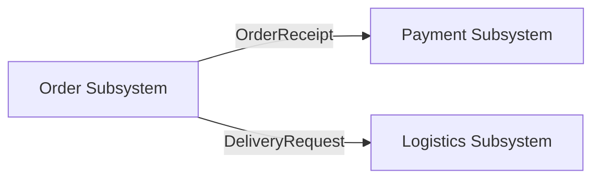

# Synthesis-Driven Development (SyDD)

## Applying the Synthesis of Form to Specification-Driven Software Design

---

# Part 1: The Design Principle

## 1.1 The Power Inversion

For decades, code has been king. Specifications served code -- they were scaffolding we built and discarded once the "real work" of coding began. We wrote PRDs to guide development, created design docs to inform implementation, drew diagrams to visualize architecture. But these were always subordinate to the code itself. Code was truth. Everything else was, at best, good intentions.

Synthesis-Driven Development inverts this power structure. Specifications do not serve code -- code serves specifications. The specification is not a guide for implementation; it is the source that generates implementation. Technical plans are not documents that inform coding; they are precise definitions that produce code. This is not an incremental improvement to how we build software. It is a fundamental rethinking of what drives development.

The gap between specification and implementation has plagued software development since its inception. We have tried to bridge it with better documentation, more detailed requirements, stricter processes. These approaches fail because they accept the gap as inevitable. They try to narrow it but never eliminate it. SyDD eliminates the gap by making specifications and their concrete implementation plans executable. When specifications and implementation plans generate code, there is no gap -- only transformation.

This transformation is now possible because AI can understand and implement complex specifications. But raw AI generation without structure produces chaos. SyDD provides that structure through a rigorous methodology grounded in Christopher Alexander's *Notes on the Synthesis of Form* (1964) -- a mathematical framework for decomposing complex design problems into independently solvable subsystems.

In this new world, maintaining software means evolving specifications. The intent of the development team is expressed in natural language ("intent-driven development"), design assets, core principles, and other guidelines. The lingua franca of development moves to a higher level, and code is the last-mile artifact.

---

## 1.2 Why Alexander's Synthesis of Form

Christopher Alexander identified a fundamental problem that applies directly to software design:

**Selfconscious designers invent arbitrary categories that misrepresent problem structure.**

Software architects do this constantly. We organize systems around categories like "frontend/backend", "controllers/services/repositories", or "microservice boundaries" that feel natural to us but may not correspond to how requirements actually interact. Alexander calls these arbitrary groupings "concepts" -- intensionally defined (by meaning we assign) rather than extensionally defined (by the actual requirements they cover).

The result: systems whose structure fits the designer's mental model instead of the problem's actual structure. Components that should be together are split. Components that should be independent are entangled. The system "fits poorly" in Alexander's terms.

Alexander's fix is methodical:

1. **List every way a design can fail** (misfit variables) -- not what the system should do, but how it could fail to satisfy its environment.
2. **Map which failures affect each other** (interaction graph) -- build a graph G(M,L) where M is misfits and L is their causal links.
3. **Decompose that graph into semi-independent clusters** -- find natural groupings where internal interactions are dense and external interactions are weak.
4. **Create a constructive diagram per cluster** (pattern) -- a description that simultaneously captures what the requirements demand and what physical form satisfies them.

The clusters can be mixed, matched, and improved independently. The design's structure mirrors the problem's structure, not whatever categories the designer invented.

### The Subsystem Argument

Alexander demonstrates with a lights analogy: 100 independent lights reach equilibrium in 2 seconds. 100 fully coupled lights take 10^22 years. But 10 subsystems of 10 lights each take only 15 minutes.

No complex adaptive system succeeds unless adaptation proceeds subsystem by subsystem. This is the mathematical heart of decomposition: when we identify the natural subsystem boundaries in a problem, we reduce the solution space from intractable to manageable.

Traditional software design ("selfconscious" in Alexander's terms) fails because its arbitrary categories break subsystem boundaries that should be preserved. Requirements that interact strongly end up in different modules. Requirements with no interaction share a module. The result is coupling where there should be cohesion, and fragmentation where there should be unity.

### From Architecture to Software

In Alexander's domain, the "Form" is a physical building and the "Context" is everything that makes demands on it (climate, social practices, materials, regulations). Good fit means the absence of identifiable misfits between form and context.

In software, the mapping is direct:

| Alexander's Concept | Software Equivalent |
|---------------------|---------------------|
| Context | The environment the software operates in: users, external systems, business rules, constraints, data flows |
| Form | The software system: its architecture, modules, APIs, data models |
| Misfit | A way the software can fail to satisfy its context: a use case not supported, a constraint violated, a failure mode unhandled |
| Ensemble | The combined system of software + environment -- misfits describe properties of this ensemble, not of the software alone |
| Constructive Diagram | A design pattern that simultaneously resolves a cluster of misfits and implies a module structure |
| Program (Decomposition) | The hierarchy of subsystems derived from misfit interaction analysis |

---

## 1.3 The SyDD Workflow

SyDD organizes the development lifecycle into five phases that mirror Alexander's method. Each phase has a precise input, output, and transformation rule.

### Phase 1: Context Gathering (The Universe)

*"To bake a pie first you must create the universe" -- Carl Sagan*

Systems do not exist in a vacuum. They interact with other systems, with users, and with business processes. These interactions define the behavior of the system's subsystems. The first phase defines what these interactions are and what outcomes they demand.

**Input**: An idea -- often vague and incomplete.

**Process**: Through iterative dialogue, the idea becomes a comprehensive understanding of the system's context:

- **Use Cases**: What the system must enable. Each use case describes an interaction between the system and its environment. Use cases define the "Context" in Alexander's terms.
- **Misfits**: Every identifiable way the system can fail to satisfy its context. Not what the system should do, but how it could fail. Misfits are binary variables: either the system handles the situation (fit) or it does not (misfit). This is a negative definition -- good design is the absence of all identifiable misfits.
- **Constraints**: Non-functional requirements, organizational policies, technology standards, performance thresholds. These are permanent misfits -- the system must never violate them.
- **Assumptions**: Conditions assumed to be true that, if false, would change the design.

**Output**: A specification document (spec.md) containing use cases, misfits, constraints, assumptions, scope, and success criteria.

**Key insight**: Misfits are more actionable than requirements. "The system must handle payment failures gracefully" is vague. "Misfit: Payment fails but the order is sent to the restaurant's kitchen" is precise -- it describes a specific failure, involves specific subsystems, and has a testable resolution.

### Phase 2: Decomposition (The Program)

**Input**: The specification with its use cases and misfits.

**Process**: Analyze interactions between misfits to discover the problem's natural structure:

1. **Build the interaction graph**: For each pair of misfits, determine whether resolving one forces changes to the resolution of the other. If yes, they are linked. The result is a graph G(M,L) where M is the set of misfits and L is the set of links.

2. **Identify subsystem boundaries**: Group misfits into clusters where:
   - **Internal interactions are dense** -- misfits within a cluster strongly affect each other
   - **External interactions are sparse** -- misfits in different clusters are largely independent

   These clusters are the natural subsystems. Their boundaries emerge from the problem itself, not from the designer's arbitrary categories.

3. **Define the hierarchy**: Subsystems may themselves decompose into sub-subsystems. The result is a tree -- Alexander's "program" -- that tells the designer which requirements to address together.

**Output**: A decomposition section in the plan document showing subsystem boundaries, their justification (which misfits interact), and the hierarchy.

**Key insight**: The decomposition is derived from the problem, not imposed by the designer. If "payment failure" and "inventory check" strongly interact (because a failed payment must reverse an inventory hold), they belong in the same subsystem. If "delivery address validation" has zero interaction with either, it belongs in a separate subsystem. The designer does not decide this -- the interaction graph reveals it.

### Phase 3: Design (Constructive Diagrams)

**Input**: The decomposition tree with its subsystem boundaries.

**Process**: For each subsystem, create a design that simultaneously expresses what the requirements demand and what software structure satisfies them. Alexander calls these "constructive diagrams." In software terms, they are:

- **Abstract Components**: Each subsystem produces a group of abstract components. Components within a subsystem have high internal coupling (they strongly affect each other) and low external coupling (they weakly affect other subsystems). Each abstract component:
  - Owns a set of behaviors (functionality)
  - Owns a set of entities (data models)
  - Has a defined boundary (API, interface, protocol)

- **Inter-system Contracts**: Where subsystems must interact, define explicit contracts that govern the interaction. Contracts specify what flows between subsystems, not how subsystems implement their internals. The contract is the only permitted coupling between subsystems.

**Output**: A plan document (plan.md) containing abstract components per subsystem, their entities and behaviors, inter-system contracts, and the technical decisions that support them.

**Key insight**: The constructive diagram has a dual function -- it is simultaneously a requirement diagram (what must be achieved) and a form diagram (what structure achieves it). A good abstract component is specific enough to satisfy its misfits but general enough to represent all valid implementations. It resists the verbal preconceptions that plague selfconscious design.

### Phase 4: Synthesis (Tasks and Implementation)

**Input**: The plan with its abstract components and inter-system contracts.

**Process**: Transform abstract components into concrete implementations. This is the actual code generation phase:

- **Work Packages**: Each abstract component (or small group of related components) becomes one or more work packages. The WP inherits the component's misfits as its acceptance criteria.
- **TDD Against Misfits**: For each misfit assigned to a component, write a test that reproduces the misfit condition and verify the implementation eliminates it. The misfits become test cases directly.
- **Contract Implementation**: Inter-system contracts are implemented as APIs, schemas, event contracts, or protocol interfaces. The implementation must not create interactions between subsystems that are not defined in the plan or modify how they interact.
- **Data Model Realization**: Entities defined in the abstract components become concrete data models, migrations, and storage schemas.

**Output**: tasks.md with work packages, execution schedule, and individual WP prompt files. Implementation code in isolated worktrees.

**Key insight**: The tasks phase must not violate the decomposition. A work package must not create coupling between subsystems that the decomposition identified as independent. A work package must not split logic that the decomposition identified as belonging together. The decomposition is the structural contract; the tasks phase is the synthesis that respects it.

### Phase 5: Verification (Review, Accept, Merge)

**Input**: Implemented work packages in isolated worktrees.

**Process**: Verify that the implementation achieves the specification's goals:

- **Review**: Check that each WP's implementation resolves its assigned misfits, respects inter-system contracts, and does not introduce new misfits.
- **Accept**: Verify all WPs for a feature are complete, all acceptance criteria pass, and the feature artifacts (spec.md, plan.md, tasks.md) are consistent.
- **Merge**: Compose the subsystem implementations into the target branch. Since subsystems are semi-independent by construction, composition should be mechanical rather than creative.

**Output**: Merged, verified feature on the target branch.

**Key insight**: Because the decomposition mirrors the problem's structure, review is tractable. Each subsystem can be reviewed against its own misfits without understanding the entire system. Merge conflicts between subsystems indicate a decomposition failure -- the subsystems were not as independent as claimed.

---

## 1.4 Core Principles

**1. Misfits Over Requirements**: Define how the system can fail before defining what it should do. Misfits are concrete, testable, and reveal subsystem boundaries. Requirements are abstract and hide coupling.

**2. Problem-Derived Structure**: The system's architecture must mirror the problem's structure, not the designer's mental model. Subsystem boundaries emerge from misfit interaction analysis, not from arbitrary categories like "frontend/backend" or "service A/service B."

**3. Dense Internal, Sparse External**: Every architectural unit (module, service, component) must have strong internal coupling (its parts strongly affect each other) and weak external coupling (it weakly affects other units). This is Alexander's decomposition criterion, and it is the fundamental test of good architecture.

**4. Constructive Diagrams as Dual Descriptions**: Every design element must simultaneously express what is required and what structure satisfies the requirement. A design that specifies behavior without implying structure is incomplete. A structure without traceable requirements is arbitrary.

**5. Specifications as the Lingua Franca**: The specification is the primary artifact. Code is its expression in a particular language and framework. Maintaining software means evolving specifications. Debugging means fixing specifications and plans that generate incorrect code.

**6. Hierarchical Decomposition**: Complex systems decompose recursively. A subsystem may itself be a system of sub-subsystems. The process is self-similar: context, misfits, decomposition, constructive diagrams, synthesis -- at every level.

**7. Continuous Refinement**: Production reality informs specification evolution. Metrics, incidents, and operational learnings become new misfits that trigger the next iteration. The methodology is not waterfall -- it is a continuous cycle of specification, decomposition, synthesis, and feedback.

**8. Executable Specifications**: Specifications and their implementation plans must be precise, complete, and unambiguous enough to generate working systems. The gap between intent and implementation is eliminated through transformation, not translation.

---

## 1.5 Worked Example: Food Delivery Checkout API

This example demonstrates the full SyDD workflow applied to a concrete system.

### Context Gathering

**Use Cases:**
- UC1: A customer submits a list of food items they want to buy.
- UC2: The system securely charges the customer's credit card.
- UC3: The restaurant receives the order immediately to start cooking.
- UC4: The system calculates accurate delivery fees based on the user's location.

**Misfits (How the system can fail its context):**
- Misfit A (Data Integrity): The user submits an order with zero items or a negative total cost.
- Misfit B (Inventory): The user orders an item that sold out while they were browsing.
- Misfit C (Financial/State): The payment fails, but the order is still sent to the restaurant's kitchen.
- Misfit D (Logistics): The delivery address is outside the restaurant's allowed radius.
- Misfit E (Concurrency): Two users order the last unit of an item simultaneously; both orders are accepted.
- Misfit F (Idempotency): A network timeout causes the client to retry, creating a duplicate charge.

### Decomposition

**Interaction analysis:**
- Misfit A (Data Integrity) and Misfit B (Inventory) are highly linked -- both involve validating the contents and availability of items in the cart. Resolving B (inventory check) requires touching the same validation pipeline as A.
- Misfit C (Financial) and Misfit D (Logistics) have near-zero interaction. A declined credit card has nothing to do with whether a shipping address is valid.
- Misfit E (Concurrency) is linked to B (Inventory) -- both involve item availability state.
- Misfit F (Idempotency) is linked to C (Financial) -- both involve payment state management.

**Subsystem boundaries (derived from interaction graph):**

1. **Order Subsystem** [Misfits A, B, E]: Handles item validation, cart totals, and inventory checks. The concurrency misfit (E) lives here because it interacts with inventory state.
2. **Payment Subsystem** [Misfits C, F]: Handles credit card validation, charging, and financial state. The idempotency misfit (F) lives here because it interacts with payment state.
3. **Logistics Subsystem** [Misfit D]: Handles address verification and delivery fee calculation.

### Constructive Diagrams (Abstract Components)

**Order Subsystem:**
- Abstract Components: CartValidator, InventoryChecker, OrderAssembler
- Entities: CartItem, Order, InventoryRecord
- Behaviors: validate cart contents, check item availability with pessimistic locking, assemble order from validated cart
- Internal coupling: CartValidator must check InventoryChecker before OrderAssembler runs

**Payment Subsystem:**
- Abstract Components: PaymentProcessor, IdempotencyGuard, TransactionLog
- Entities: PaymentIntent, Transaction, IdempotencyKey
- Behaviors: create payment intent, verify idempotency key before charging, log transaction state
- Internal coupling: IdempotencyGuard must approve before PaymentProcessor charges

**Inter-system Contract: Order -> Payment:**
- The Order Subsystem produces a validated OrderReceipt (items confirmed available, totals computed).
- The Payment Subsystem consumes the OrderReceipt and returns a PaymentResult (success/failure).
- If PaymentResult is failure, Order Subsystem releases inventory holds.
- This contract is the only permitted coupling between Order and Payment.

**Inter-system Contract: Order -> Logistics:**
- The Order Subsystem provides a DeliveryRequest (delivery address, restaurant location).
- The Logistics Subsystem returns a DeliveryFeeResult (fee amount, or rejection with reason).
- This happens before OrderAssembler finalizes the order.

### Synthesis

Work packages map directly to abstract components:
- WP01: CartValidator + InventoryChecker (Misfits A, B, E) -- TDD: test empty cart rejection, sold-out item detection, concurrent reservation conflict
- WP02: PaymentProcessor + IdempotencyGuard (Misfits C, F) -- TDD: test payment failure does not trigger kitchen notification, test duplicate charge prevention
- WP03: Logistics address validation (Misfit D) -- TDD: test out-of-radius rejection
- WP04: Inter-system contracts (Order->Payment, Order->Logistics) -- TDD: test contract compliance, test failure propagation

The misfits were eliminated at the structural level by the decomposition. The resulting software fits its required environment without unnecessary complexity.

---

# Part 2: Implementation via spec-bridge-v2 Skills

This section maps the SyDD methodology to concrete changes in the spec-bridge-v2 skill architecture. Each subsection describes what changes to the skill's template, contract (`SkillOutputContract`), and validation logic are required.

The reference implementations are specs `042-spec-bridge-commands-as-cursor-skills` and `043-modular-skill-aligned-cli-refactor`, which demonstrate what well-formed SDD output looks like across spec.md, plan.md, tasks.md, and WP files.

---

## 2.1 Current Skill Architecture

spec-bridge-v2 has 7 skill modules plus an `init` command:

| Skill | Produces | Key Validations |
|-------|----------|-----------------|
| `specify` | spec.md | Frontmatter + body sections + placeholder count |
| `plan` | plan.md | Template filled + technical section |
| `tasks` | tasks.md, tasks/WP*.md, execution-schedule.json | WP frontmatter + schedule schema |
| `implement` | (modifies WP frontmatter) | WP lane=doing, agent, history, worktree exists |
| `review` | (modifies WP frontmatter) | WP lane=for_review, review_status, reviewed_by |
| `accept` | (modifies WP frontmatter) | WP lane=done, Activity Log, spec/plan/tasks exist |
| `merge` | (feature-level) | All WP lane=done, worktrees removed |

Each skill has two layers: the **skill layer** (AI agent instructions, template, workflow intent) and the **CLI layer** (deterministic validation, outcome verification via `SkillOutputContract`).

---

## 2.2 Skill Modifications

### 2.2.1 `specify` Skill -- Add Context and Misfits

The specify skill currently produces a spec.md with User Scenarios, Requirements, Key Entities, Success Criteria, Assumptions, and Out of Scope. The SyDD methodology requires explicit context gathering and misfit identification as the foundation for all downstream work.

**Template changes** (modify `skills/specify/template.md`):

Add two new mandatory sections and restructure the flow. The template should guide the AI agent toward Alexander-style context gathering rather than traditional requirements listing.

```markdown
# Feature Specification: [TODO: Feature Name]

**Feature Branch**: `[TODO: ###-feature-name]`
**Created**: [TODO: YYYY-MM-DD]
**Status**: Draft

---

## Context *(mandatory)*

### System Interactions

[TODO: Describe the environment the software operates in. Who and what
interacts with this system? List external systems, user roles, data flows,
and business processes that make demands on the system.]

### Use Cases

[TODO: Each use case describes a specific interaction between the system and
its environment. Use the format: UC#: Actor + Action + Expected Outcome]

- **UC1**: [TODO: actor] [TODO: action] [TODO: outcome]
- **UC2**: [TODO: actor] [TODO: action] [TODO: outcome]

---

## Misfits *(mandatory)*

[TODO: List every identifiable way the system can fail to satisfy its
context. Each misfit is a specific failure scenario -- not what the system
should do, but how it could fail. Tag each misfit with the domain it
affects (e.g., Data Integrity, Financial, Concurrency, Security).]

- **Misfit A** ([TODO: domain]): [TODO: specific failure scenario]
- **Misfit B** ([TODO: domain]): [TODO: specific failure scenario]
- **Misfit C** ([TODO: domain]): [TODO: specific failure scenario]

### Misfit Interaction Notes

[TODO: Which misfits affect each other? If resolving one misfit forces
changes to the resolution of another, they are linked. Document known
interactions here. This feeds the decomposition in the plan phase.]

---

## User Scenarios & Testing *(mandatory)*

### User Story 1 - [TODO: Title] (Priority: P1)

[TODO: As a ... I want ... So that ...]

**Why this priority**: [TODO: Explain why this is the highest-priority story]

**Independent Test**: [TODO: Describe how to validate this story end-to-end]

**Acceptance Scenarios**:

1. **Given** [TODO], **When** [TODO], **Then** [TODO]

---

## Requirements *(mandatory)*

### Functional Requirements

- **FR-001**: [TODO: Derived from use cases and misfit resolutions]

### Non-Functional Requirements (Constraints)

- **NFR-001**: [TODO: These are permanent misfits -- conditions the system
  must never violate. Performance, security, compliance.]

---

## Key Entities

- **[TODO: Entity Name]**: [TODO: Description, key fields, relationships]

---

## Success Criteria *(mandatory)*

- **SC-001**: [TODO: Measurable outcome linked to misfit elimination]

---

## Assumptions

- [TODO: Conditions assumed true that, if false, would change the design]

---

## Out of Scope

- [TODO: Explicitly list what this feature does NOT cover]
```

**Contract changes** (modify `skills/specify/skill.py`):

Add new checks to `SpecifySkill.run_checks()`:

| Check Name | Rule | Description |
|-----------|------|-------------|
| `body_context_non_empty` | SyDD-S01 | `## Context` section exists and has content |
| `body_misfits_non_empty` | SyDD-S02 | `## Misfits` section exists and has at least 2 misfits |
| `body_use_cases_present` | SyDD-S03 | `### Use Cases` subsection exists with at least one UC |

Existing checks (`body_user_scenarios_non_empty`, `body_requirements_non_empty`, `body_placeholder_count`) remain unchanged. The new checks are additive -- they do not replace existing FR-016 validations.

**Schema changes**: Add optional `misfits_count` field to `spec.yaml` schema (integer, populated by the CLI after validation for downstream awareness).

**Rationale**: The Context and Misfits sections are the foundation of the entire SyDD methodology. Without them, the plan phase has no interaction graph to analyze, and the decomposition becomes arbitrary. Making them mandatory ensures the AI agent gathers the right information before proceeding.

---

### 2.2.2 `plan` Skill -- Add Decomposition, Abstract Components, and Contracts

The plan skill currently produces a plan.md with Summary, Technical Context, Constitution Check, Project Structure, Phase 0/1, Implementation Phases, Key Design Decisions, Risk Register, and Open Questions. SyDD requires the plan to include an explicit decomposition step derived from misfit interactions, abstract component definitions per subsystem, and inter-system contracts.

**Template changes** (modify `skills/plan/template.md`):

Add three new sections after Phase 0 and before Implementation Phases. These sections formalize the analytical step that Alexander prescribes.

```markdown
## Phase 0: Research

[TODO: Research findings, resolved unknowns]

---

## Decomposition *(mandatory)*

### Misfit Interaction Graph

[TODO: For each pair of misfits from spec.md, determine whether resolving
one forces changes to the resolution of the other. Document linked pairs.
This can be a table, a list, or a Mermaid graph.]

| Misfit | Linked To | Reason |
|--------|-----------|--------|
| A (Data Integrity) | B (Inventory) | Both validate cart contents |
| C (Financial) | F (Idempotency) | Both involve payment state |

### Subsystem Boundaries

[TODO: Group linked misfits into subsystems. Each subsystem contains misfits
that strongly interact. Subsystems are weakly connected to each other.
Justify each boundary with interaction evidence.]

1. **[TODO: Subsystem Name]** [Misfits: A, B, E]
   - **Boundary justification**: [TODO: Why these misfits belong together]
   - **External interactions**: [TODO: Which other subsystems this one must
     communicate with, and why]

2. **[TODO: Subsystem Name]** [Misfits: C, F]
   - **Boundary justification**: [TODO]
   - **External interactions**: [TODO]

---

## Abstract Components *(mandatory)*

[TODO: For each subsystem, define its abstract components. Each component
owns a set of behaviors and entities. Components within a subsystem have
high internal coupling and low external coupling.]

### [TODO: Subsystem Name]

**Components:**
- **[TODO: Component Name]**: [TODO: Behaviors it owns, entities it manages]
- **[TODO: Component Name]**: [TODO: Behaviors, entities]

**Entities:**
- **[TODO: Entity Name]**: [TODO: Key fields and relationships]

**Internal coupling**: [TODO: How these components interact within the subsystem]

---

## Inter-System Contracts *(mandatory if >1 subsystem)*

[TODO: Define the contracts between subsystems. A contract specifies what
data flows between subsystems, not how subsystems implement their internals.
The contract is the only permitted coupling between subsystems.]

### Contract: [TODO: Subsystem A] -> [TODO: Subsystem B]

- **Producer**: [TODO: What the producing subsystem provides]
- **Consumer**: [TODO: What the consuming subsystem expects]
- **Failure mode**: [TODO: What happens if the contract fails]
- **Implementation method**: [TODO: API, event, schema, protocol -- decided here,
  implemented in tasks phase]

---

## Phase 1: Design & Contracts

[TODO: Data models, API contracts, key design decisions]

---

## Implementation Phases and WP Candidates

[TODO: WP candidates must align with subsystem boundaries. Each WP
implements one or more abstract components from a single subsystem.
A WP must not span subsystem boundaries unless it implements a contract.]

| Phase | WPs | Subsystem | Depends on | Can parallelise |
|-------|-----|-----------|------------|-----------------|
| [TODO] | WP01 | [TODO: subsystem] | -- | No |
| [TODO] | WP02, WP03 | [TODO: subsystem] | WP01 | Yes |
```

**Contract changes** (modify `skills/plan/skill.py`):

Add new checks to `PlanSkill.run_checks()`:

| Check Name | Rule | Description |
|-----------|------|-------------|
| `body_decomposition_present` | SyDD-P01 | `## Decomposition` section exists and has content |
| `body_abstract_components_present` | SyDD-P02 | `## Abstract Components` section exists and has content |
| `body_contracts_present_if_multiple_subsystems` | SyDD-P03 | If `## Decomposition` contains >1 subsystem, `## Inter-System Contracts` must exist |
| `wp_candidates_have_subsystem` | SyDD-P04 | Each WP candidate in `## Implementation Phases` has a `Subsystem` column value |

Existing checks (`body_template_filled`, `body_technical_approach`) remain unchanged.

**Rationale**: The plan is where decomposition happens. Without explicit misfit interaction analysis, subsystem boundaries are arbitrary. Without abstract components, work packages lack the structural guidance needed to produce a system whose architecture mirrors the problem. Without contracts, subsystem interactions are implicit and prone to coupling drift.

---

### 2.2.3 `tasks` Skill -- Add Subsystem Traceability and Misfit Coverage

The tasks skill currently produces tasks.md with work packages, an execution schedule, and individual WP prompt files. SyDD requires that WPs trace back to abstract components and subsystems, and that every misfit from the spec is covered by at least one WP.

**Template changes** (modify `skills/tasks/template.md`):

Add subsystem traceability to WP definitions and a misfit coverage matrix.

```markdown
## Work Package WP01: [TODO: Title] (Priority: P0)

**Goal**: [TODO: what this WP delivers]
**Subsystem**: [TODO: which subsystem from plan.md this WP implements]
**Abstract Components**: [TODO: which components from plan.md]
**Misfits Addressed**: [TODO: which misfits from spec.md this WP resolves]
**Independent Test**: [TODO: how to verify completion]
**Prompt**: `tasks/WP01-[TODO: slug].md`

### Included Subtasks
- [ ] T001 [TODO: subtask description]

### TDD Targets (from Misfits)
- [ ] Test: [TODO: misfit-derived test scenario]

### Dependencies
- None (first WP)

---

## Misfit Coverage Matrix

[TODO: Every misfit from spec.md must appear in at least one WP's
"Misfits Addressed" field. Uncovered misfits are implementation gaps.]

| Misfit | Domain | Covered by WP(s) |
|--------|--------|-------------------|
| A | Data Integrity | WP01 |
| B | Inventory | WP01 |
| C | Financial | WP02 |
```

**Contract changes** (modify `skills/tasks/skill.py`):

Add new checks to `TasksSkill.run_checks()`:

| Check Name | Rule | Description |
|-----------|------|-------------|
| `wp_has_subsystem_field` | SyDD-T01 | Each WP file's body or frontmatter references a subsystem |
| `misfit_coverage_section_present` | SyDD-T02 | `## Misfit Coverage Matrix` section exists in tasks.md |

**WP frontmatter schema changes** (modify `init_cmd/schemas/v1/wp.yaml`):

Add optional fields to the WP schema:

```yaml
- name: subsystem
  type: str
  required: false
  default: ""
- name: misfits_addressed
  type: list[str]
  required: false
  default: []
- name: abstract_components
  type: list[str]
  required: false
  default: []
```

**Rationale**: Traceability from WPs back to subsystems and misfits is the mechanism that prevents decomposition drift during implementation. The misfit coverage matrix makes it impossible for a misfit to fall through the cracks -- every identified failure mode must be assigned to a WP that resolves it. The TDD targets derived from misfits connect Alexander's analytical framework directly to test-driven development.

---

### 2.2.4 `implement` Skill -- TDD Against Misfits

The implement skill currently manages worktree creation and WP lane transitions. SyDD adds the expectation that the AI agent uses the WP's `misfits_addressed` field to drive TDD.

**Adapter template changes** (modify `adapters/templates/implement.md`):

Add a workflow step after worktree creation:

```markdown
## TDD from Misfits

Before writing implementation code, read the WP's `misfits_addressed`
frontmatter field. For each misfit:

1. Write a test that reproduces the misfit condition (the system fails
   in the way described by the misfit).
2. Run the test to confirm it fails (red).
3. Write the minimum implementation to make the test pass (green).
4. Refactor while keeping tests green.

This ensures every identified failure mode has a corresponding test, and
the implementation is driven by misfit elimination rather than feature
accumulation.
```

**Contract changes**: No changes to `ImplementSkill.run_checks()`. The existing FR-019 checks (lane=doing, agent set, worktree exists) remain sufficient. TDD discipline is encoded in the skill instructions, not in the CLI validation layer -- consistent with the CLI vs Skill responsibility boundary.

**Rationale**: The implement skill is where synthesis happens. By directing the AI agent to write tests from misfits first, the methodology ensures that implementation is grounded in the analytical work done during decomposition. The CLI does not validate test existence (that would violate the boundary rule), but the skill instructions encode it as a mandatory workflow step.

---

### 2.2.5 `review` Skill -- Misfit Elimination Check

The review skill currently validates WP lane transitions and review metadata. SyDD adds review criteria that check whether the implementation resolves its assigned misfits and respects subsystem boundaries.

**Adapter template changes** (modify `adapters/templates/review.md`):

Add review checklist items:

```markdown
## SyDD Review Checklist

In addition to standard code review, verify:

1. **Misfit Resolution**: For each misfit in the WP's `misfits_addressed`
   field, confirm that a test exists and passes. The misfit is structurally
   eliminated, not just handled with error checking.

2. **Subsystem Boundary Respect**: The implementation does not introduce
   coupling between subsystems that is not declared in the plan's
   Inter-System Contracts section. No imports, calls, or data flows
   cross subsystem boundaries outside of contracted interfaces.

3. **Contract Compliance**: If this WP implements an inter-system contract,
   verify that the implementation matches the contract specification in
   plan.md (producer output, consumer input, failure mode handling).

4. **No New Misfits**: The implementation does not introduce failure modes
   that are not covered by existing misfits or documented as new misfits
   requiring a spec update.
```

**Contract changes**: No changes to `ReviewSkill.run_checks()`. Review quality criteria are encoded in the skill instructions. The CLI validates lane transitions and metadata -- review judgment remains AI-driven.

---

### 2.2.6 `accept` and `merge` Skills -- No Structural Changes

The accept and merge skills operate at the feature level and validate completeness (all WPs done, all artifacts present, worktrees cleaned up). Their validation logic is agnostic to the SyDD methodology -- they verify process completion, not design quality.

**No template, contract, or schema changes required.**

---

## 2.3 New Skill: `decompose` (Optional, Recommended for Complex Features)

For features with more than 5 misfits, the decomposition step in the plan phase can become complex enough to warrant its own dedicated skill. The `decompose` skill sits between `specify` and `plan` and produces a standalone decomposition artifact.

**When to use**: Features with >5 misfits, >3 potential subsystems, or where misfit interactions are non-obvious and require explicit graph analysis.

**When to skip**: Small features with <5 misfits where the decomposition can be done inline in plan.md.

### Skill Definition

**Artifact produced**: `decomposition.md` in the feature directory.

**Template** (`skills/decompose/template.md`):

```markdown
# Decomposition: [TODO: Feature Name]

**Feature**: `[TODO: ###-feature-name]`
**Date**: [TODO: YYYY-MM-DD]
**Spec**: [spec.md](spec.md)

---

## Misfit Inventory

[TODO: Copy all misfits from spec.md. For each misfit, assign an ID
(A, B, C...) and note the domain.]

| ID | Domain | Description |
|----|--------|-------------|
| A | [TODO] | [TODO] |

---

## Interaction Matrix

[TODO: For each pair of misfits, mark whether they interact (X) or not (-).
Two misfits interact if resolving one forces changes to the resolution of
the other.]

|   | A | B | C | D | E |
|---|---|---|---|---|---|
| A | - | X | - | - | - |
| B | X | - | - | - | X |
| C | - | - | - | - | - |
| D | - | - | - | - | - |
| E | - | X | - | - | - |

---

## Subsystem Identification

[TODO: Group misfits into clusters based on the interaction matrix.
Each cluster has dense internal interactions and sparse external
interactions. Name each subsystem and justify the boundary.]

### Subsystem 1: [TODO: Name]

**Misfits**: [TODO: A, B, E]
**Boundary justification**: [TODO: Why these misfits cluster together]
**Diagrammability**: [TODO: Does this cluster suggest a coherent software
module? What structure resolves all its misfits simultaneously?]

---

## Subsystem Interaction Map

[TODO: Document how subsystems interact with each other. These interactions
become the inter-system contracts in plan.md.]



---

## Decomposition Validation

- [ ] Every misfit from spec.md appears in exactly one subsystem
- [ ] No subsystem has misfits with zero internal interaction
- [ ] Subsystem interactions are documented and will become contracts
- [ ] The decomposition is derivable from the interaction matrix
  (not from arbitrary categories)
```

### Contract (SkillOutputContract)

| Check Name | Rule | Description |
|-----------|------|-------------|
| `decomposition_exists` | SyDD-D01 | `decomposition.md` exists in feature directory |
| `decomposition_readable` | SyDD-D02 | File is readable and frontmatter parseable |
| `misfit_inventory_non_empty` | SyDD-D03 | `## Misfit Inventory` has at least 2 rows |
| `interaction_matrix_present` | SyDD-D04 | `## Interaction Matrix` section exists |
| `subsystems_identified` | SyDD-D05 | At least one `### Subsystem` heading exists |

### Schema (add `decomposition.yaml` to `init_cmd/schemas/v1/`)

```yaml
artifact_type: decomposition
schema_version: v1
fields:
  - name: feature_slug
    type: str
    required: true
  - name: status
    type: str
    required: true
    default: draft
  - name: created
    type: str
    required: true
  - name: misfits_count
    type: int
    required: false
  - name: subsystems_count
    type: int
    required: false
```

### Integration with Existing Skills

- The `plan` skill's template references `decomposition.md` as an optional input alongside `spec.md`. If `decomposition.md` exists, the plan's Decomposition section is pre-populated from it.
- The `plan` skill's contract does NOT require `decomposition.md` to exist -- the decomposition can be done inline in plan.md for simple features.
- The `tasks` skill reads subsystem names from either `decomposition.md` or plan.md's Decomposition section.

---

## 2.4 Skills Removed

No skills are removed. All 7 existing skills (specify, plan, tasks, implement, review, accept, merge) retain their roles. The SyDD methodology enhances them with additional structure rather than replacing them.

---

## 2.5 Validation Harness Changes

### New Validation Rules

All new rules are prefixed with `SyDD-` to distinguish them from existing `FR-` rules.

| Rule ID | Skill | Check | Severity |
|---------|-------|-------|----------|
| SyDD-S01 | specify | `## Context` section non-empty | Error |
| SyDD-S02 | specify | `## Misfits` section has >= 2 misfits | Error |
| SyDD-S03 | specify | `### Use Cases` subsection exists | Error |
| SyDD-P01 | plan | `## Decomposition` section non-empty | Error |
| SyDD-P02 | plan | `## Abstract Components` section non-empty | Error |
| SyDD-P03 | plan | `## Inter-System Contracts` exists if >1 subsystem | Warning |
| SyDD-P04 | plan | WP candidates have `Subsystem` column | Warning |
| SyDD-T01 | tasks | WP body/frontmatter references a subsystem | Warning |
| SyDD-T02 | tasks | `## Misfit Coverage Matrix` exists | Warning |
| SyDD-D01 | decompose | `decomposition.md` exists (only if skill invoked) | Error |
| SyDD-D02 | decompose | File readable and frontmatter parseable | Error |
| SyDD-D03 | decompose | Misfit inventory has >= 2 rows | Error |
| SyDD-D04 | decompose | Interaction matrix present | Error |
| SyDD-D05 | decompose | At least one subsystem identified | Error |

Rules marked **Warning** are advisory -- they do not cause non-zero exit. Rules marked **Error** cause non-zero exit. This allows gradual adoption: teams can start using SyDD without being blocked by missing subsystem fields on WPs.

### Schema Additions

New artifact schema file: `init_cmd/schemas/v1/decomposition.yaml` (only created if `decompose` skill is included in the project's skill set).

Modified schemas:
- `wp.yaml`: Add optional `subsystem`, `misfits_addressed`, `abstract_components` fields
- `spec.yaml`: Add optional `misfits_count` field

No existing required fields are removed or renamed. All changes are additive.

---

## 2.6 Reference: How Existing Specs Map to SyDD Phases

The specs in `specs/042-*` and `specs/043-*` are examples of good SDD output. Here is how their structure maps to SyDD phases, showing what would change and what would stay the same.

### spec.md (042 and 043)

**Already present (keep):**
- User Stories with Given/When/Then acceptance scenarios
- Priority ranking with rationale
- Independent tests per story
- Numbered functional requirements (FR-001, FR-002...)
- Success criteria (SC-001, SC-002...)
- Edge cases and clarifications
- Assumptions and out of scope

**Would add under SyDD:**
- **Context section**: The "Tool Objective" and "CLI vs Skill Responsibility Boundary" in 043's spec.md is effectively a context description. SyDD formalizes this as a mandatory section with explicit system interactions and use cases.
- **Misfits section**: The "Edge Cases" section in 043's spec.md lists 25+ failure scenarios. SyDD promotes these from an appendix to a primary artifact, tags them by domain, and maps their interactions.

### plan.md (043)

**Already present (keep):**
- Technical Context (language, dependencies, storage, testing)
- Constitution Check
- Project Structure
- Phase 0: Research
- Phase 1: Design & Contracts (data models, CLI contracts)
- Implementation Phases and WP Candidates
- Key Design Decisions
- Risk Register

**Would add under SyDD:**
- **Decomposition section**: 043's plan implicitly decomposes the system (core vs skills vs adapters vs init) but does not show the interaction analysis that justifies these boundaries. SyDD requires explicit misfit-to-subsystem mapping.
- **Abstract Components section**: 043's plan describes the module layout but does not formally define each component's owned behaviors and entities. SyDD formalizes this.
- **Inter-System Contracts section**: 043's plan defines the `SkillOutputContract` protocol and the CLI command contracts. SyDD would consolidate these as formal inter-system contracts between the Core, Skill, and Adapter subsystems.

### tasks.md (043)

**Already present (keep):**
- WPs with goal, independent test, prompt file reference
- Subtask index with priority and parallelization
- Dependency graph and execution schedule
- Requirement references per WP

**Would add under SyDD:**
- **Subsystem column** in WP definitions (e.g., WP01: Core, WP04-WP10: Skills, WP03: Adapters)
- **Misfits Addressed** per WP (traced from spec.md edge cases)
- **Misfit Coverage Matrix** ensuring every edge case from spec.md is covered by at least one WP

---

## 2.7 Adoption Path

SyDD is designed for incremental adoption alongside existing spec-bridge-v2 skills.

**Phase 1 (Minimal)**: Add Context and Misfits sections to the specify template. Add Decomposition and Abstract Components sections to the plan template. No schema or contract changes. The new sections are guidance for the AI agent, enforced by convention.

**Phase 2 (Enforced)**: Add `SyDD-S01`, `SyDD-S02`, `SyDD-P01`, `SyDD-P02` validation rules to the specify and plan skill contracts. The CLI now verifies these sections are non-empty. Teams that do not use SyDD can disable these rules via `spec-bridge.conf` (add a `methodology: sydd | classic` config option).

**Phase 3 (Full)**: Add the `decompose` skill for complex features. Add WP schema fields (`subsystem`, `misfits_addressed`, `abstract_components`). Add the misfit coverage matrix check. Add `SyDD-T01`, `SyDD-T02` validation rules to the tasks skill.

Each phase is independently valuable and does not require the subsequent phases to provide benefit.
