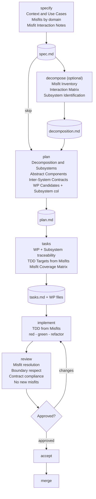

# Synthesis-Driven Development

## A Design Methodology and Its Implementation in spec-bridge-v2

---

# Part 1: The Methodology

## 1.1 The Problem with How We Design Software

Software architects organize systems around categories that feel natural -- frontend/backend, controllers/services/repositories, microservice boundaries -- but that may not correspond to how requirements actually interact. Christopher Alexander identified this exact problem in *Notes on the Synthesis of Form* (1964): selfconscious designers invent arbitrary groupings that misrepresent problem structure. The result is coupling where there should be cohesion, and fragmentation where there should be unity.

Synthesis-Driven Development (SyDD) applies Alexander's mathematical framework for decomposing complex design problems to software engineering. Instead of starting from what a system *should do* (requirements), SyDD starts from how a system can *fail to satisfy its context* (misfits). Instead of imposing architectural categories, SyDD derives subsystem boundaries from the interaction structure of those misfits.

The methodology integrates with Specification-Driven Development (SDD), where specifications are the source of truth and code is their expression. SyDD adds analytical rigor to the specification process: before planning, decompose the problem using Alexander's method. Before implementing, verify that work packages respect the decomposition.

---

## 1.2 Core Concepts

### Context and Form

In Alexander's framework, the **Context** is everything that makes demands on a system: users, external systems, business rules, data flows, constraints. The **Form** is the system itself. Good design means the absence of identifiable failures in the relationship between form and context.

| Alexander's Concept | Software Equivalent |
|---------------------|---------------------|
| Context | The environment: users, external systems, business rules, constraints |
| Form | The software system: modules, APIs, data models |
| Misfit | A way the software can fail its context: unsupported use case, violated constraint, unhandled failure |
| Ensemble | The combined system + environment; misfits are properties of this ensemble |
| Constructive Diagram | A design pattern that simultaneously resolves a cluster of misfits and implies a module structure |
| Program (Decomposition) | The hierarchy of subsystems derived from misfit interaction analysis |

### Misfits

A misfit is a specific, testable failure scenario. Not what the system should do, but how it could fail.

- **Bad (requirement)**: "The system must handle payment failures gracefully."
- **Good (misfit)**: "Payment fails but the order is sent to the restaurant's kitchen."

Misfits are more actionable than requirements because they describe concrete failures involving specific subsystems and have testable resolutions. They are binary: the system either handles the situation (fit) or does not (misfit).

### The Subsystem Argument

Alexander demonstrates with a lights analogy: 100 independent lights reach equilibrium in 2 seconds. 100 fully coupled lights take 10^22 years. But 10 subsystems of 10 lights each take only 15 minutes.

No complex system succeeds unless adaptation proceeds subsystem by subsystem. When we identify the natural subsystem boundaries in a problem, we reduce the solution space from intractable to manageable. Traditional design fails because arbitrary categories break these natural boundaries.

---

## 1.3 The Five Phases

### Phase 1: Context Gathering

**Input**: An idea, often vague.

**Process**: Through iterative dialogue, define the system's context:
- **Use Cases**: Interactions between the system and its environment. These define the Context in Alexander's terms.
- **Misfits**: Every identifiable way the system can fail its context. Tagged by domain (Data Integrity, Financial, Concurrency, Security, etc.).
- **Constraints**: Non-functional requirements -- permanent misfits the system must never violate.
- **Misfit Interactions**: Which misfits affect each other. If resolving one forces changes to the resolution of another, they are linked.

**Output**: A specification document containing use cases, misfits with domain tags, misfit interaction notes, user scenarios, requirements, and success criteria.

### Phase 2: Decomposition

**Input**: The specification with its misfits.

**Process**:
1. **Build the interaction graph**: For each pair of misfits, determine whether resolving one forces changes to the resolution of the other. The result is a graph G(M,L) where M is misfits and L is links.
2. **Identify subsystem boundaries**: Group misfits into clusters where internal interactions are dense and external interactions are sparse. These clusters are the natural subsystems.
3. **Define the hierarchy**: Subsystems may themselves decompose into sub-subsystems recursively.

**Output**: Subsystem boundaries with justification (which misfits interact and why they cluster), documented in the plan or in a standalone decomposition artifact.

**Key insight**: The decomposition is derived from the problem, not imposed by the designer. If "payment failure" and "inventory check" strongly interact, they belong in the same subsystem. If "address validation" has zero interaction with either, it is a separate subsystem. The interaction graph reveals this -- the designer does not decide it.

### Phase 3: Design (Constructive Diagrams)

**Input**: The decomposition with subsystem boundaries.

**Process**: For each subsystem, create abstract components -- design elements that simultaneously express what the requirements demand and what software structure satisfies them:
- **Abstract Components**: Each owns behaviors, entities, and a defined boundary. Components within a subsystem have high internal coupling and low external coupling.
- **Inter-system Contracts**: Where subsystems must interact, define explicit contracts specifying what flows between them. The contract is the only permitted coupling.

**Output**: A plan document with abstract components per subsystem, their entities and behaviors, and inter-system contracts.

### Phase 4: Synthesis (Tasks and Implementation)

**Input**: The plan with abstract components and contracts.

**Process**:
- Each abstract component becomes one or more work packages. The WP inherits the component's misfits as acceptance criteria.
- For each misfit assigned to a WP, write a test that reproduces the misfit condition and verify the implementation eliminates it. Misfits become test cases directly.
- Inter-system contracts are implemented as APIs, schemas, or event contracts. Implementation must not create interactions not defined in the plan.

**Output**: Work packages with misfit traceability, a misfit coverage matrix ensuring nothing is missed, and implementation code in isolated worktrees.

### Phase 5: Verification

**Input**: Implemented work packages.

**Process**:
- **Review**: Check that each WP resolves its assigned misfits, respects subsystem boundaries, and does not introduce new misfits.
- **Accept**: Verify all WPs are complete and feature artifacts are consistent.
- **Merge**: Compose subsystem implementations. Since subsystems are semi-independent by construction, merge conflicts indicate a decomposition failure.

---

## 1.4 Core Principles

1. **Misfits Over Requirements**: Define how the system can fail before defining what it should do. Misfits are concrete, testable, and reveal subsystem boundaries.

2. **Problem-Derived Structure**: Architecture mirrors the problem's structure, not the designer's mental model. Subsystem boundaries emerge from misfit interaction analysis.

3. **Dense Internal, Sparse External**: Every architectural unit has strong internal coupling (its parts strongly affect each other) and weak external coupling (it weakly affects other units). This is Alexander's decomposition criterion.

4. **Constructive Diagrams as Dual Descriptions**: Every design element simultaneously expresses what is required and what structure satisfies the requirement.

5. **Specifications as Lingua Franca**: The specification is the primary artifact. Code is its expression. Maintaining software means evolving specifications.

6. **Hierarchical Decomposition**: Complex systems decompose recursively. The process is self-similar at every level.

7. **Continuous Refinement**: Production reality informs specification evolution. Metrics, incidents, and operational learnings become new misfits that trigger the next iteration.

8. **Executable Specifications**: Specifications must be precise enough to generate working systems. The gap between intent and implementation is eliminated through transformation.

---

## 1.5 Worked Example: Food Delivery Checkout API

### Context Gathering

**Use Cases:**
- UC1: Customer submits a list of food items to buy.
- UC2: System charges the customer's credit card.
- UC3: Restaurant receives the order to start cooking.
- UC4: System calculates delivery fees based on location.

**Misfits:**
- Misfit A (Data Integrity): User submits an order with zero items or negative total.
- Misfit B (Inventory): User orders an item that sold out while browsing.
- Misfit C (Financial/State): Payment fails but order is sent to the kitchen.
- Misfit D (Logistics): Delivery address is outside the restaurant's radius.
- Misfit E (Concurrency): Two users order the last unit simultaneously; both accepted.
- Misfit F (Idempotency): Network timeout causes client retry, creating a duplicate charge.

### Decomposition

**Interaction analysis:**
- A and B are linked: both validate cart contents and availability.
- C and F are linked: both involve payment state management.
- E is linked to B: both involve item availability state.
- D has near-zero interaction with the others.

**Subsystem boundaries:**
1. **Order Subsystem** [Misfits A, B, E]: Item validation, cart totals, inventory with pessimistic locking.
2. **Payment Subsystem** [Misfits C, F]: Credit card charging, idempotency guards, transaction logging.
3. **Logistics Subsystem** [Misfit D]: Address verification, delivery fee calculation.

### Constructive Diagrams

**Order Subsystem:**
- Components: CartValidator, InventoryChecker, OrderAssembler
- Entities: CartItem, Order, InventoryRecord
- Internal coupling: CartValidator must check InventoryChecker before OrderAssembler runs

**Payment Subsystem:**
- Components: PaymentProcessor, IdempotencyGuard, TransactionLog
- Entities: PaymentIntent, Transaction, IdempotencyKey
- Internal coupling: IdempotencyGuard must approve before PaymentProcessor charges

**Inter-system Contract (Order -> Payment):**
- Producer: Order provides a validated OrderReceipt (items confirmed, totals computed).
- Consumer: Payment returns a PaymentResult (success/failure).
- Failure mode: If payment fails, Order releases inventory holds.

### Synthesis

Work packages map to abstract components:
- WP01: CartValidator + InventoryChecker (Misfits A, B, E)
- WP02: PaymentProcessor + IdempotencyGuard (Misfits C, F)
- WP03: Logistics address validation (Misfit D)
- WP04: Inter-system contracts (Order->Payment, Order->Logistics)

Every misfit has a WP. Every WP has tests derived from its misfits.

---

---

# Part 2: Implementation in spec-bridge-v2

The SyDD methodology is implemented across the spec-bridge-v2 skill architecture. This section documents the concrete changes: what was modified, what was added, and how the validation harness enforces SyDD structure.

---

## 2.1 Skill Architecture Overview

spec-bridge-v2 now has 8 skill modules plus an `init` command:

| Skill | Produces | SyDD Role |
|-------|----------|-----------|
| `specify` | spec.md | Context gathering + misfit identification |
| `decompose` | decomposition.md | Standalone misfit interaction analysis (new) |
| `plan` | plan.md | Subsystem design + abstract components + contracts |
| `tasks` | tasks.md, WP files, schedule | WP-to-subsystem traceability + misfit coverage |
| `implement` | (modifies WP state) | TDD from misfits |
| `review` | (modifies WP state) | SyDD review checklist |
| `accept` | (modifies WP state) | Unchanged |
| `merge` | (feature-level) | Unchanged |

Each skill has two layers:
- **Skill layer**: AI agent instructions, templates, workflow guidance. This is where SyDD methodology is encoded as workflow steps.
- **CLI layer**: Deterministic validation via `SkillOutputContract`. This is where SyDD structure is enforced through automated checks.

The boundary between these layers is strict: the CLI validates artifact structure; the skill instructions encode design judgment. The CLI never evaluates whether a decomposition is *good* -- it only verifies that the decomposition *exists* and has the required structural elements.

---

## 2.2 Specify Skill -- Context and Misfits

The specify template now opens with two mandatory sections before User Scenarios:

**`## Context` section** with `### System Interactions` and `### Use Cases` subsections. This replaces the implicit context that was previously scattered across User Stories. Use cases follow the format `UC#: Actor + Action + Outcome`.

**`## Misfits` section** with domain-tagged failure scenarios and a `### Misfit Interaction Notes` subsection. Each misfit follows the format `- **Misfit X** (domain): failure description`. The minimum is 2 misfits -- trivial features with fewer than 2 identifiable failure modes do not benefit from SyDD analysis.

All existing sections (User Scenarios, Requirements, Key Entities, Success Criteria, Assumptions, Out of Scope) remain unchanged below the new sections.

### Validation checks added

| Check | Rule | Behavior |
|-------|------|----------|
| `body_context_non_empty` | SyDD-S01 | `## Context` section must exist with content. Error if missing. |
| `body_misfits_non_empty` | SyDD-S02 | `## Misfits` section must exist with >= 2 entries matching `^- \*\*Misfit\b`. Error if missing or insufficient. |
| `body_use_cases_present` | SyDD-S03 | `### Use Cases` subsection must exist with content. Error if missing. |

### Schema addition

`spec.yaml` gains an optional `misfits_count` field (integer) for downstream awareness.

### Implementation note

The existing `_has_non_empty_section()` helper was updated to use `"\n## "` (with trailing space) as the section boundary marker instead of `"\n##"`. This prevents `###` subsection headers from being treated as section boundaries, which is critical for sections like `## Context` that contain `### System Interactions` and `### Use Cases` as internal structure.

---

## 2.3 Decompose Skill (New)

A new skill for features where misfit interaction analysis is complex enough to warrant a standalone artifact. It sits between `specify` and `plan` in the workflow.

**When to use**: Features with 5+ misfits, 3+ potential subsystems, or non-obvious misfit interactions.

**When to skip**: Simple features where decomposition can be done inline in plan.md's Decomposition section.

### Template structure

The `decompose` template produces `decomposition.md` with five sections:

1. **Misfit Inventory**: Table with ID, Misfit name, Domain, Description. Imports every misfit from spec.md.
2. **Interaction Matrix**: Pairwise matrix marking linked misfits with X. The basis for all decomposition decisions.
3. **Subsystem Identification**: Grouped misfits with boundary justification and key responsibilities.
4. **Constructive Diagrams**: Per-subsystem diagrams showing how components resolve assigned misfits.
5. **Cross-Subsystem Contracts**: Data exchange, failure modes, and coupling type between subsystems.
6. **Mapping to Plan**: Bridges decomposition output to plan.md input.

### Validation checks

| Check | Rule | Behavior |
|-------|------|----------|
| `decomposition_exists` | SyDD-D01 | File present on disk. Error if missing. |
| `decomposition_readable` | SyDD-D02 | Frontmatter parseable. Error if corrupt. |
| `misfit_inventory_non_empty` | SyDD-D03 | `## Misfit Inventory` has >= 2 data rows (excluding header and separator). Error if insufficient. |
| `interaction_matrix_present` | SyDD-D04 | `## Interaction Matrix` section exists and is non-empty. Error if missing. |
| `subsystems_identified` | SyDD-D05 | At least one `### Subsystem` heading exists in the body. Error if missing. |

### Schema

New file `decomposition.yaml` with fields: `feature_slug` (required), `status` (required, default "draft"), `created` (required), `misfits_count` (optional int), `subsystems_count` (optional int).

### CLI and adapter wiring

- CLI command `decompose` registered between `specify` and `plan`, using `--feature` and `--session-id` (no WP argument).
- Added to `SKILL_NAMES` in `adapters/base.py` between `"specify"` and `"plan"`.
- Adapter template `decompose.md` follows the same frontmatter pattern as other non-WP skills.

---

## 2.4 Plan Skill -- Decomposition, Components, and Contracts

The plan template now includes three new mandatory sections between Phase 0: Research and Phase 1: Design & Contracts:

**`## Decomposition`** with `### Misfit Interaction Graph` (table or Mermaid graph of linked misfit pairs) and `### Subsystem Boundaries` (numbered subsystems with misfits, boundary justification, and external interactions).

**`## Abstract Components`** with per-subsystem component definitions including owned behaviors, entities, and internal coupling description.

**`## Inter-System Contracts` (mandatory if >1 subsystem)** with producer/consumer/failure-mode contracts per subsystem pair.

The existing `## Implementation Phases and WP Candidates` table gains a **Subsystem** column, requiring WP candidates to align with subsystem boundaries.

### Validation checks added

| Check | Rule | Behavior |
|-------|------|----------|
| `body_decomposition_present` | SyDD-P01 | `## Decomposition` section must exist with content. Error if missing. |
| `body_abstract_components_present` | SyDD-P02 | `## Abstract Components` section must exist with content. Error if missing. |
| `body_contracts_present_if_multiple_subsystems` | SyDD-P03 | If `## Decomposition` contains >= 2 `### Subsystem` headings, warns if `## Inter-System Contracts` is absent. Advisory (always passes). |
| `wp_candidates_have_subsystem` | SyDD-P04 | If `## Implementation Phases` exists, warns if the table lacks a "Subsystem" column. Advisory (always passes). |

### Implementation note

`_has_non_empty_section()`, `_extract_section()`, and `_count_subsystem_headings()` are implemented as module-level helpers within `plan/skill.py` (duplicated from specify, not shared via core, respecting the skill isolation rule).

---

## 2.5 Tasks Skill -- Subsystem Traceability and Misfit Coverage

The tasks template now includes per-WP traceability fields and a coverage matrix:

Each WP definition block includes:
- **Subsystem**: Which subsystem from plan.md this WP implements.
- **Abstract Components**: Which components from plan.md.
- **Misfits Addressed**: Which misfits from spec.md this WP resolves.
- **TDD Targets (from Misfits)**: Test scenarios derived directly from the assigned misfits.

A new **`## Misfit Coverage Matrix`** section appears before the Dependency & Execution Summary. This is a table mapping every misfit to the WP(s) that address it. Uncovered misfits are implementation gaps.

### Validation checks added

| Check | Rule | Behavior |
|-------|------|----------|
| `wp-has-subsystem` | SyDD-T01 | Per-WP advisory check. Warns if the WP frontmatter lacks a `subsystem` field. Advisory (always passes). |
| `misfit-coverage-section` | SyDD-T02 | Checks tasks.md body for `## Misfit Coverage Matrix`. Warns if absent. Advisory (always passes). |

### Schema additions

`wp.yaml` gains three optional fields:
- `subsystem` (str, default "")
- `misfits_addressed` (list, default [])
- `abstract_components` (list, default [])

All optional -- existing WP files remain valid without them.

---

## 2.6 Implement Skill -- TDD from Misfits

The implement adapter template includes a new `## TDD from Misfits` section inserted into the workflow after worktree creation and before the commit step. It instructs the AI agent to:

1. Read the WP's `misfits_addressed` frontmatter field.
2. For each misfit, write a test that reproduces the misfit condition (red).
3. Write the minimum implementation to make the test pass (green).
4. Refactor while keeping tests green.

No changes to `ImplementSkill.run_checks()`. TDD discipline is encoded in skill instructions, not CLI validation -- consistent with the CLI vs Skill responsibility boundary. The CLI validates lane transitions and worktree state; design judgment remains AI-driven.

---

## 2.7 Review Skill -- SyDD Checklist

The review adapter template includes a new `## SyDD Review Checklist` section with four verification items:

1. **Misfit Resolution**: For each misfit in `misfits_addressed`, confirm a test exists and passes. The misfit is structurally eliminated, not just handled with error checking.
2. **Subsystem Boundary Respect**: No coupling between subsystems outside of declared Inter-System Contracts. No imports, calls, or data flows cross boundaries outside contracted interfaces.
3. **Contract Compliance**: If the WP implements a contract, verify the implementation matches plan.md (producer output, consumer input, failure mode handling).
4. **No New Misfits**: The implementation does not introduce failure modes not covered by existing misfits.

No changes to `ReviewSkill.run_checks()`. Review quality criteria are encoded in skill instructions.

---

## 2.8 Accept and Merge Skills

No structural changes. These skills validate process completion (all WPs done, all artifacts present, worktrees cleaned up) and are agnostic to SyDD methodology.

---

## 2.9 Validation Rule Summary

All new rules are prefixed with `SyDD-` to distinguish them from existing `FR-` rules.

| Rule | Skill | Check | Severity |
|------|-------|-------|----------|
| SyDD-S01 | specify | `## Context` section non-empty | Error |
| SyDD-S02 | specify | `## Misfits` has >= 2 entries | Error |
| SyDD-S03 | specify | `### Use Cases` subsection exists | Error |
| SyDD-P01 | plan | `## Decomposition` section non-empty | Error |
| SyDD-P02 | plan | `## Abstract Components` non-empty | Error |
| SyDD-P03 | plan | `## Inter-System Contracts` if >1 subsystem | Warning (advisory) |
| SyDD-P04 | plan | WP candidates have Subsystem column | Warning (advisory) |
| SyDD-T01 | tasks | WP frontmatter has subsystem field | Warning (advisory) |
| SyDD-T02 | tasks | `## Misfit Coverage Matrix` in tasks.md | Warning (advisory) |
| SyDD-D01 | decompose | `decomposition.md` exists | Error |
| SyDD-D02 | decompose | File readable, frontmatter parseable | Error |
| SyDD-D03 | decompose | Misfit inventory has >= 2 rows | Error |
| SyDD-D04 | decompose | Interaction matrix present | Error |
| SyDD-D05 | decompose | At least one subsystem identified | Error |

Error rules cause non-zero exit. Warning rules always pass but include a descriptive reason noting the absence, enabling gradual adoption.

---

## 2.10 Complete Skill Workflow

The flow is linear but the `decompose` step is optional. For simple features (< 5 misfits), the decomposition can be done inline within plan.md's `## Decomposition` section. The plan skill's validation does not require `decomposition.md` to exist.

---

## 2.11 Files Modified and Created

### Modified files

| File | Change |
|------|--------|
| `skills/specify/template.md` | Added `## Context` and `## Misfits` sections before User Scenarios |
| `skills/specify/skill.py` | Added 3 checks (SyDD-S01, S02, S03), `_count_misfits()` helper, fixed `_has_non_empty_section()` boundary detection |
| `skills/specify/tests/test_specify.py` | Added `TestSpecifySyDD` class (7 tests), updated `_VALID_BODY` fixture, updated rule assertion |
| `skills/plan/template.md` | Added `## Decomposition`, `## Abstract Components`, `## Inter-System Contracts` sections; added Subsystem column to WP table |
| `skills/plan/skill.py` | Added 4 checks (SyDD-P01 through P04), `_has_non_empty_section()`, `_extract_section()`, `_count_subsystem_headings()` helpers |
| `skills/plan/tests/test_plan.py` | Added `TestPlanSyDD` class (9 tests), updated `_FILLED_BODY` fixture |
| `skills/tasks/template.md` | Added Subsystem/Components/Misfits fields per WP, TDD Targets subsection, Misfit Coverage Matrix section |
| `skills/tasks/skill.py` | Added 2 checks (SyDD-T01, T02) |
| `skills/tasks/tests/test_tasks.py` | Added `TestTasksSyDD` class (4 tests) |
| `adapters/templates/implement.md` | Added `## TDD from Misfits` section in workflow |
| `adapters/templates/review.md` | Added `## SyDD Review Checklist` section |
| `adapters/base.py` | Added `"decompose"` to `SKILL_NAMES` |
| `cli.py` | Added `cmd_decompose` command |
| `init_cmd/schemas/v1/wp.yaml` | Added `subsystem`, `misfits_addressed`, `abstract_components` optional fields |
| `init_cmd/schemas/v1/spec.yaml` | Added `misfits_count` optional field |

### New files

| File | Purpose |
|------|---------|
| `skills/decompose/__init__.py` | Package marker |
| `skills/decompose/skill.py` | `DecomposeSkill` with 5 checks (SyDD-D01 through D05) |
| `skills/decompose/template.md` | Decomposition template (Misfit Inventory, Interaction Matrix, Subsystem Identification, Constructive Diagrams, Cross-Subsystem Contracts, Mapping to Plan) |
| `skills/decompose/tests/__init__.py` | Package marker |
| `skills/decompose/tests/test_decompose.py` | 17 tests covering all 5 checks and metadata invariants |
| `adapters/templates/decompose.md` | Adapter template for the decompose skill |
| `init_cmd/schemas/v1/decomposition.yaml` | Schema for decomposition.md frontmatter |

### No files removed

All 7 original skills retain their roles. SyDD enhances them with additional structure rather than replacing anything.
