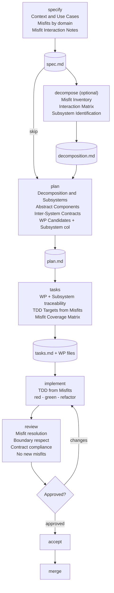

# Building Software with Synthesis-Driven Development

A practical guide for developers new to specification-driven workflows.

---

# Part 1: What Is Synthesis-Driven Development?

## The Problem

Most software projects start the same way. Someone describes what they want. A developer jumps into code. Along the way, they discover edge cases nobody thought of, make architectural choices under pressure, and end up with a system whose structure reflects the order in which problems were discovered rather than the nature of the problems themselves.

The result is familiar: modules that seem logical ("UserService", "PaymentController", "OrderRepository") but hide tangled dependencies. Changing the payment flow breaks inventory. Adding a delivery option requires touching five services. The architecture mirrors how the team thought about the problem, not how the problem actually works.

Synthesis-Driven Development (SyDD) is a methodology that fixes this. Instead of organizing software around intuitive categories, it analyzes how requirements interact and derives the system's structure from that analysis. The architecture mirrors the problem's structure, not the developer's mental model.

## The Key Idea: Misfits Instead of Requirements

Traditional development starts with requirements -- statements about what a system should do:

> "The system must handle payment failures gracefully."

This is vague. What does "gracefully" mean? Which components are involved? How does this interact with order processing? Requirements describe intent but hide the real complexity.

SyDD starts from the opposite direction. Instead of asking "what should the system do?", it asks "how can the system fail?"

> "Misfit: The payment fails, but the order is still sent to the restaurant's kitchen."

This is concrete. It names two specific things (payment, kitchen notification) and a specific failure (one fails but the other proceeds). It immediately reveals that payment and order dispatch are coupled -- you cannot design one without considering the other.

These failure scenarios are called **misfits** -- ways the system can fail to satisfy its environment. They are the foundation of SyDD.

## Why Misfits Work Better

Misfits have three properties that make them powerful for design:

**They are testable.** "Handle payment failures gracefully" has no clear test. "Payment fails but order reaches the kitchen" is a test case you can write right now.

**They reveal structure.** If two misfits interact -- resolving one forces you to change how you resolve the other -- they belong in the same subsystem. If they do not interact, they can be designed independently. This interaction pattern reveals the natural architecture.

**They are binary.** Either the system handles the situation or it does not. There is no ambiguity about whether a misfit has been resolved.

## The Origin: Christopher Alexander

SyDD is grounded in the work of architect Christopher Alexander, who published *Notes on the Synthesis of Form* in 1964. Alexander was solving a problem in building design: how do you decompose a complex design into parts that can be worked on independently?

His answer was methodical:

1. List every way a design can fail its environment (misfits).
2. Map which failures affect each other (the interaction graph).
3. Group tightly interacting failures into clusters (subsystems).
4. Design each cluster independently.

The clusters have a critical property: things inside a cluster strongly affect each other (dense internal coupling), while things in different clusters barely affect each other (sparse external coupling). This is exactly the property that makes good software modules.

Alexander demonstrated the power of decomposition with a simple analogy. Imagine 100 lights that need to reach a stable state. If they are all independent, equilibrium takes 2 seconds. If they are all coupled together, it takes longer than the age of the universe. But if you group them into 10 subsystems of 10 lights each, it takes 15 minutes.

The lesson: complex systems only become tractable when you find the right subsystem boundaries. Those boundaries exist in the problem itself -- the designer's job is to discover them, not invent them.

## The Five Phases of SyDD

SyDD organizes development into five phases:

### Phase 1: Context Gathering

Understand the system's environment. Who uses it? What external systems does it interact with? What business rules apply? Then identify every way the system can fail that environment -- every misfit. Tag each misfit with a domain (Data Integrity, Financial, Concurrency, Security, etc.) and note which misfits affect each other.

**You produce**: A specification document with use cases, misfits, constraints, and interaction notes.

### Phase 2: Decomposition

Analyze misfit interactions to discover natural subsystem boundaries. Build a graph where misfits are nodes and interactions are edges. Group tightly connected misfits into clusters. Each cluster becomes a subsystem.

**You produce**: A decomposition showing which misfits belong to which subsystem and why.

### Phase 3: Design

For each subsystem, define abstract components -- design elements that describe what behaviors and data the subsystem owns. Where subsystems must communicate, define explicit contracts specifying what data flows between them. The contract is the only permitted coupling.

**You produce**: A plan with abstract components per subsystem and inter-system contracts.

### Phase 4: Synthesis (Implementation)

Transform abstract components into code. Each component becomes a work package. For each misfit assigned to a work package, write a test that reproduces the failure condition (the misfit), then write the minimum code to make the test pass. This is Test-Driven Development (TDD), but driven by misfits rather than arbitrary test cases.

**You produce**: Working code in isolated branches, one per work package.

### Phase 5: Verification

Review each work package against its assigned misfits. Does it resolve them? Does it respect subsystem boundaries? Does it introduce new failure modes? Then merge the work packages into the main codebase.

**You produce**: A verified, merged feature.

## A Quick Note on TDD

Test-Driven Development is a practice where you write tests before writing implementation code. The cycle is:

1. **Red**: Write a test that describes the behavior you want. Run it. It fails (because the code does not exist yet).
2. **Green**: Write the minimum code to make the test pass.
3. **Refactor**: Clean up the code while keeping the test green.

In SyDD, the misfits tell you what tests to write. Each misfit is a failure scenario -- a test that says "the system fails in this specific way." You write a test that reproduces the misfit, then write code that eliminates it. This connects the analytical work (decomposition) directly to the implementation work (coding).

## Worked Example: Food Delivery Checkout

To make this concrete, here is SyDD applied to a food delivery checkout system.

### Context Gathering

**Use cases:**
- A customer submits food items to buy.
- The system charges the customer's credit card.
- The restaurant receives the order to start cooking.
- The system calculates delivery fees based on location.

**Misfits -- how the system can fail:**

| ID | Domain | Failure Scenario |
|----|--------|-----------------|
| A | Data Integrity | User submits an order with zero items or negative total |
| B | Inventory | User orders an item that sold out while browsing |
| C | Financial/State | Payment fails but order is sent to the kitchen |
| D | Logistics | Delivery address is outside the restaurant's radius |
| E | Concurrency | Two users order the last unit simultaneously; both accepted |
| F | Idempotency | Network timeout causes retry, creating a duplicate charge |

### Decomposition

Analyze which misfits interact:
- **A and B interact**: Both validate cart contents and availability. Fixing one affects how you fix the other.
- **C and F interact**: Both involve payment state. Idempotency (F) directly affects how payment failure (C) is handled.
- **E interacts with B**: Both involve item availability state.
- **D has near-zero interaction** with the others. Address validation is independent.

This reveals three natural subsystems:

1. **Order Subsystem** [Misfits A, B, E]: Everything about validating and assembling the order.
2. **Payment Subsystem** [Misfits C, F]: Everything about charging and financial state.
3. **Logistics Subsystem** [Misfit D]: Address and delivery fee calculation.

These boundaries were not decided by the developer -- they emerged from analyzing which misfits interact.

### Design

**Order Subsystem** components: CartValidator, InventoryChecker, OrderAssembler. Internal coupling: CartValidator must check InventoryChecker before OrderAssembler runs.

**Payment Subsystem** components: PaymentProcessor, IdempotencyGuard, TransactionLog. Internal coupling: IdempotencyGuard must approve before PaymentProcessor charges.

**Contract (Order -> Payment):** Order produces a validated OrderReceipt. Payment returns a PaymentResult. If payment fails, Order releases inventory holds.

### Synthesis

Work packages map to components:
- WP01: CartValidator + InventoryChecker. TDD targets: test zero-item rejection, test sold-out detection, test concurrent reservation conflict.
- WP02: PaymentProcessor + IdempotencyGuard. TDD targets: test payment failure does not notify kitchen, test duplicate charge prevention.
- WP03: Logistics validation. TDD targets: test out-of-radius rejection.
- WP04: Inter-system contracts. TDD targets: test contract compliance, test failure propagation.

Every misfit has a work package. Every work package has tests derived from its misfits.

---

# Part 2: Using spec-bridge-v2 to Build Software with SyDD

spec-bridge-v2 is a tool that guides you through the SyDD workflow step by step. It provides templates for each phase, validates that your artifacts have the required structure, and keeps everything organized in a predictable directory layout.

You do not need to memorize the methodology. The templates tell you what to fill in. The validation tool tells you if you missed something.

## How It Works

spec-bridge-v2 has eight skills, each corresponding to a step in the workflow. An AI coding assistant (like Cursor, Claude Code, or similar) reads the skill instructions and walks you through the process interactively. At the end of each step, a validation tool (`spec-bridge-skill-tool`) checks that the output has the required structure.

The workflow is linear:

```
specify -> decompose (optional) -> plan -> tasks -> implement -> review -> accept -> merge
```

Each step produces artifacts (markdown files with structured content) in a feature directory under `specs/`.

## Prerequisites

Install the skill tool:

```bash
cd skill-tool
pip install -e .
```

Initialize a project:

```bash
spec-bridge-skill-tool init --project-root .
```

This creates the `specs/` directory, copies schema files, and generates skill instruction files for your AI agent.

## Step 1: Specify -- Describe What You Are Building

**What happens**: You have a conversation with the AI agent about what you want to build. The agent asks discovery questions scaled to the complexity of the feature (1-2 for simple, 5+ for complex). Then it creates a `spec.md` file.

**Command**: Run the `spec-bridge-specify` skill (via slash command or agent instruction).

**What you produce**: A `specs/<feature-slug>/spec.md` file. The template has these sections:

### Context (mandatory)

Describe the environment the software operates in. The template asks for two things:

**System Interactions** -- Who and what interacts with this system? List external systems, user roles, data flows, and business processes.

**Use Cases** -- Each use case is a specific interaction. Use the format: `UC#: Actor + Action + Expected Outcome`.

For the food delivery example:
```markdown
## Context

### System Interactions

The checkout API interacts with: customers (via mobile/web app),
the restaurant management system (receives orders), a payment gateway
(Stripe), and a delivery routing service (calculates fees and ETAs).

### Use Cases

- **UC1**: Customer submits a list of food items to purchase
- **UC2**: System charges the customer's credit card via Stripe
- **UC3**: Restaurant receives the confirmed order to begin preparation
- **UC4**: System calculates delivery fee based on customer location
```

### Misfits (mandatory)

List every way the system can fail. Tag each with a domain. The template provides the format:

```markdown
## Misfits

- **Misfit A** (Data Integrity): User submits an order with zero items
  or a negative total cost
- **Misfit B** (Inventory): User orders an item that sold out while
  they were browsing the menu
- **Misfit C** (Financial/State): Payment fails but the order is still
  sent to the restaurant's kitchen

### Misfit Interaction Notes

A and B are linked -- both validate cart contents. C and F are linked --
both involve payment state management.
```

The validation tool requires at least 2 misfits. If you cannot identify 2 failure scenarios, the feature may be too trivial for formal specification.

### Remaining sections

The template also includes sections for User Scenarios (with Given/When/Then acceptance criteria), Requirements (functional and non-functional), Key Entities, Success Criteria, Assumptions, and Out of Scope. Fill these as you would in any specification.

### Validation

After writing spec.md, the AI agent runs:

```bash
spec-bridge-skill-tool specify --feature <feature-slug> --session-id $SESSION_ID
```

This checks:
- The Context section exists and has content (SyDD-S01).
- The Misfits section has at least 2 entries (SyDD-S02).
- The Use Cases subsection exists (SyDD-S03).
- User Scenarios and Requirements are non-empty (existing checks).
- No more than a few unresolved placeholders remain.

If validation passes, commit and move to the next step.

## Step 2 (Optional): Decompose -- Analyze Misfit Interactions

**When to use**: Features with 5+ misfits or non-obvious interactions between failure scenarios. Skip this for simple features -- the decomposition can be done inline in the plan.

**What happens**: You create a `decomposition.md` that systematically maps which misfits interact and derives subsystem boundaries.

**What you produce**: A file with four key sections:

### Misfit Inventory

A table copying every misfit from spec.md with a short ID:

```markdown
| ID | Misfit | Domain | Description |
|----|--------|--------|-------------|
| M1 | A | Data Integrity | Zero items or negative total |
| M2 | B | Inventory | Item sold out while browsing |
| M3 | C | Financial/State | Payment fails, order sent to kitchen |
```

### Interaction Matrix

A pairwise matrix showing which misfits are linked:

```markdown
|    | M1 | M2 | M3 | M4 | M5 | M6 |
|----|----|----|----|----|----|----|
| M1 | -- | X  | -  | -  | -  | -  |
| M2 | X  | -- | -  | -  | X  | -  |
| M3 | -  | -  | -- | -  | -  | X  |
```

An "X" means resolving one misfit forces changes to the resolution of the other.

### Subsystem Identification

Group linked misfits into subsystems. Justify each boundary with evidence from the matrix:

```markdown
### Subsystem Order

**Misfits**: M1, M2, M5
**Boundary justification**: M1 and M2 both validate cart contents.
M5 (concurrency) affects item availability, linking it to M2.
**Key responsibilities**: Cart validation, inventory checking, order assembly
```

### Constructive Diagrams (optional)

Sketch how each subsystem's components resolve its assigned misfits. This bridges the analytical decomposition to concrete software design.

### Validation

```bash
spec-bridge-skill-tool decompose --feature <feature-slug> --session-id $SESSION_ID
```

This checks that the misfit inventory has at least 2 rows, the interaction matrix exists, and at least one subsystem is identified.

## Step 3: Plan -- Design the Architecture

**What happens**: The AI agent asks architecture questions (language, dependencies, storage, testing approach), then creates a `plan.md` that translates the decomposition into a concrete software design.

**What you produce**: A `specs/<feature-slug>/plan.md` file. The SyDD-specific sections are:

### Decomposition (mandatory)

If you ran the decompose step, this section references that work. If not, you do the analysis here. Either way, the plan must contain:

**Misfit Interaction Graph** -- a table or diagram showing linked misfit pairs with reasons:

```markdown
| Misfit | Linked To | Reason |
|--------|-----------|--------|
| A (Data Integrity) | B (Inventory) | Both validate cart contents |
| C (Financial) | F (Idempotency) | Both involve payment state |
```

**Subsystem Boundaries** -- numbered subsystems with their misfits and justification:

```markdown
1. **Order Subsystem** [Misfits: A, B, E]
   - **Boundary justification**: All three involve cart/item state
   - **External interactions**: Sends OrderReceipt to Payment
```

### Abstract Components (mandatory)

For each subsystem, define what software components it contains:

```markdown
### Order Subsystem

**Components:**
- **CartValidator**: Validates item count, prices, totals
- **InventoryChecker**: Checks availability with pessimistic locking

**Entities:**
- **CartItem**: item_id, quantity, unit_price
- **Order**: order_id, items, total, status

**Internal coupling**: CartValidator calls InventoryChecker before assembly
```

### Inter-System Contracts (mandatory if more than one subsystem)

Define what flows between subsystems. The contract is the only permitted coupling:

```markdown
### Contract: Order -> Payment

- **Producer**: Order provides a validated OrderReceipt
- **Consumer**: Payment expects OrderReceipt, returns PaymentResult
- **Failure mode**: If payment fails, Order releases inventory holds
- **Implementation method**: Synchronous function call with result type
```

### Implementation Phases and WP Candidates

The plan includes a table mapping work packages to subsystems:

```markdown
| Phase | WPs | Subsystem | Depends on | Can parallelise |
|-------|-----|-----------|------------|-----------------|
| Core | WP01 | Order | -- | No |
| Core | WP02 | Payment | WP01 | Yes |
| Support | WP03 | Logistics | -- | Yes |
| Integration | WP04 | Contracts | WP01, WP02 | No |
```

Each WP must implement components from a single subsystem (unless it implements a contract between subsystems).

### Validation

```bash
spec-bridge-skill-tool plan --feature <feature-slug> --session-id $SESSION_ID
```

This checks that Decomposition and Abstract Components sections exist with content. It also provides advisory warnings if the WP candidates table is missing a Subsystem column or if multiple subsystems exist without an Inter-System Contracts section.

## Step 4: Tasks -- Create Work Packages

**What happens**: The AI agent reads spec.md and plan.md, derives fine-grained subtasks, groups them into work packages, and creates individual WP prompt files.

**What you produce**:
- `specs/<feature-slug>/tasks.md` -- the master task list.
- `specs/<feature-slug>/tasks/WP01-slug.md`, `WP02-slug.md`, etc. -- one prompt file per work package.

### Work package definitions

Each WP in tasks.md includes SyDD traceability fields:

```markdown
## Work Package WP01: Cart Validation (Priority: P0)

**Goal**: Validate cart contents and check inventory availability
**Subsystem**: Order
**Abstract Components**: CartValidator, InventoryChecker
**Misfits Addressed**: A (zero items), B (sold out), E (concurrency)
**Independent Test**: Submit valid and invalid carts; verify rejections
**Prompt**: `tasks/WP01-cart-validation.md`

### Included Subtasks
- [ ] T001 Implement CartValidator with item count and price checks
- [ ] T002 Implement InventoryChecker with pessimistic locking
- [ ] T003 Write concurrency tests for simultaneous last-item orders

### TDD Targets (from Misfits)
- [ ] Test: Submit order with zero items -> rejected with validation error
- [ ] Test: Submit order for sold-out item -> rejected with availability error
- [ ] Test: Two simultaneous orders for last unit -> only one succeeds

### Dependencies
- None (first WP)
```

The **Subsystem**, **Abstract Components**, and **Misfits Addressed** fields trace each WP back to the plan and spec. The **TDD Targets** translate misfits directly into test scenarios.

### Misfit Coverage Matrix

At the bottom of tasks.md, a table ensures every misfit from the spec is covered:

```markdown
## Misfit Coverage Matrix

| Misfit | Domain | Covered by WP(s) |
|--------|--------|-------------------|
| A | Data Integrity | WP01 |
| B | Inventory | WP01 |
| C | Financial/State | WP02 |
| D | Logistics | WP03 |
| E | Concurrency | WP01 |
| F | Idempotency | WP02 |
```

If a misfit does not appear in this table, it is an implementation gap. Every failure scenario you identified must have a work package responsible for eliminating it.

### WP prompt files

Each `tasks/WPxx-slug.md` file has YAML frontmatter that the tool validates:

```yaml
---
work_package_id: WP01
title: Cart Validation
lane: planned
dependencies: []
subsystem: Order
misfits_addressed: [A, B, E]
abstract_components: [CartValidator, InventoryChecker]
---
```

The `subsystem`, `misfits_addressed`, and `abstract_components` fields are optional but recommended. They enable the review step to verify that the implementation respects the decomposition.

### Validation

```bash
spec-bridge-skill-tool tasks --feature <feature-slug> --session-id $SESSION_ID
```

This checks that WP files exist with valid frontmatter. It provides advisory warnings if WP files lack a `subsystem` field or if tasks.md is missing the Misfit Coverage Matrix.

## Step 5: Implement -- Build Each Work Package

**What happens**: For each work package, the AI agent creates an isolated git worktree (a separate working directory with its own branch), implements the WP, and commits the code.

**Commands**:

```bash
# From the planning repository root:
spec-bridge agent workflow implement WP01 --agent my-agent

# Move into the worktree:
cd .worktrees/<feature-slug>-WP01/
```

### TDD from Misfits

This is where SyDD connects analysis to code. Before writing any implementation, read the WP's `misfits_addressed` field. For each misfit:

1. **Write a test** that reproduces the misfit condition. For example, for Misfit A ("zero items"):

```python
def test_empty_cart_rejected():
    cart = Cart(items=[])
    result = validate_cart(cart)
    assert result.is_error
    assert "at least one item" in result.error_message
```

2. **Run the test.** It fails because `validate_cart` does not exist yet. This is the "red" phase.

3. **Write the minimum code** to make the test pass:

```python
def validate_cart(cart: Cart) -> ValidationResult:
    if not cart.items:
        return ValidationResult.error("Cart must contain at least one item")
    return ValidationResult.ok()
```

4. **Run the test again.** It passes. This is the "green" phase.

5. **Refactor** if needed, keeping the test green.

Repeat for every misfit assigned to the WP. When done, every failure scenario has a test, and the implementation exists to eliminate each one.

### Completing the WP

After implementation:

```bash
# Commit from inside the worktree
git add <files>
git commit -m "feat(WP01): cart validation with inventory checking"

# Return to the planning repo and move the WP to review
cd <planning-repo-root>
spec-bridge agent tasks move-task WP01 --to for_review --note "Ready for review"
```

### Validation

```bash
spec-bridge-skill-tool implement --feature <feature-slug> --wp WP01 --session-id $SESSION_ID
```

This checks that the worktree exists, the WP is in the `doing` lane, and at least one commit has been made.

## Step 6: Review -- Verify Against Misfits

**What happens**: The AI agent (or a different agent/developer) reviews the implementation against the WP's acceptance criteria and the SyDD checklist.

**Command**:

```bash
spec-bridge agent workflow review WP01 --agent reviewer-agent
```

### The SyDD Review Checklist

In addition to standard code review (correctness, style, test coverage), the review verifies four SyDD-specific criteria:

1. **Misfit Resolution**: For each misfit in `misfits_addressed`, does a test exist that reproduces the failure scenario? Does it pass? Is the misfit structurally eliminated (the design prevents it) rather than just caught with error handling?

2. **Subsystem Boundary Respect**: Does the implementation introduce coupling between subsystems that is not declared in the plan's Inter-System Contracts? No imports, function calls, or data flows should cross subsystem boundaries except through contracted interfaces.

3. **Contract Compliance**: If the WP implements an inter-system contract, does the implementation match the contract specification (producer output, consumer input, failure mode handling)?

4. **No New Misfits**: Does the implementation introduce failure modes that are not covered by existing misfits? If so, they should be documented as new misfits requiring a spec update.

### Review outcome

If the review passes:
```bash
spec-bridge agent tasks move-task WP01 --to done --note "Review passed"
```

If changes are requested:
```bash
spec-bridge agent tasks move-task WP01 --to planned --review-feedback-file <feedback-file>
```

The WP goes back to the implementer for fixes.

## Step 7: Accept -- Confirm Feature Completeness

**What happens**: After all WPs reach `lane: done`, the accept step verifies that the entire feature is complete and consistent.

**Command**:

```bash
spec-bridge agent accept --actor "my-agent" --feature <feature-slug> --mode local --test "pytest tests/ -v"
```

This checks that all WPs are done, all artifacts (spec.md, plan.md, tasks.md) exist, and provides merge instructions.

## Step 8: Merge -- Compose Subsystems

**What happens**: All work package branches are merged into the target branch and worktrees are cleaned up.

**Commands**:

```bash
# Preview the merge plan
spec-bridge merge --feature <feature-slug> --dry-run --json

# Execute the merge
spec-bridge merge --feature <feature-slug>

# Clean up worktrees
git worktree remove .worktrees/<feature-slug>-WP01
git worktree remove .worktrees/<feature-slug>-WP02
```

Because subsystems are semi-independent by construction, merge conflicts should be rare. If they occur, they indicate that the decomposition had a gap -- two subsystems were more coupled than the interaction analysis suggested.

## What You End Up With

After completing all eight steps, your feature directory looks like this:

```
specs/042-checkout-api/
  spec.md                  # Use cases, misfits, requirements
  decomposition.md         # Misfit interactions, subsystem boundaries (if used)
  plan.md                  # Architecture, components, contracts, WP candidates
  tasks.md                 # WP definitions, misfit coverage matrix
  meta.json                # Feature metadata
  tasks/
    WP01-cart-validation.md    # WP prompt with subsystem traceability
    WP02-payment-processing.md
    WP03-logistics.md
    WP04-contracts.md
```

And in your codebase, you have:
- Code whose module structure mirrors the problem's subsystem structure.
- Tests derived from every identified failure scenario.
- Clear contracts governing how subsystems communicate.
- A complete paper trail from use cases through misfits through decomposition through implementation.

## Complete Skill Workflow




## Summary of the Workflow

| Step | Skill | Input | Output | Key SyDD Element |
|------|-------|-------|--------|-------------------|
| 1 | specify | Idea | spec.md | Use cases + misfits |
| 2 | decompose | spec.md | decomposition.md | Interaction matrix + subsystems |
| 3 | plan | spec.md + decomposition | plan.md | Abstract components + contracts |
| 4 | tasks | plan.md | tasks.md + WP files | Misfit coverage matrix |
| 5 | implement | WP file | Code in worktree | TDD from misfits |
| 6 | review | Code + WP spec | Review verdict | SyDD checklist |
| 7 | accept | All WPs done | Acceptance record | Completeness check |
| 8 | merge | Accepted WPs | Merged feature | Subsystem composition |

The key difference from traditional development: every architectural decision is traceable back to the misfits that motivated it, and every test is traceable back to a specific failure scenario. Nothing is arbitrary. The structure serves the problem.
