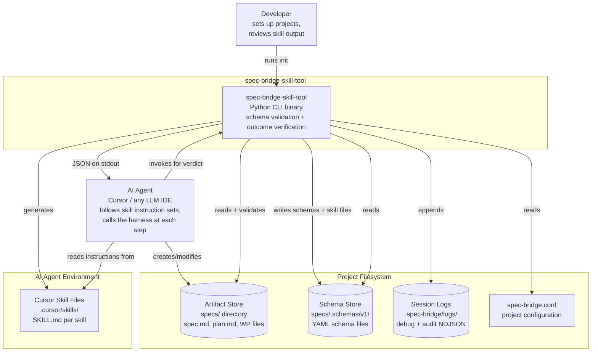
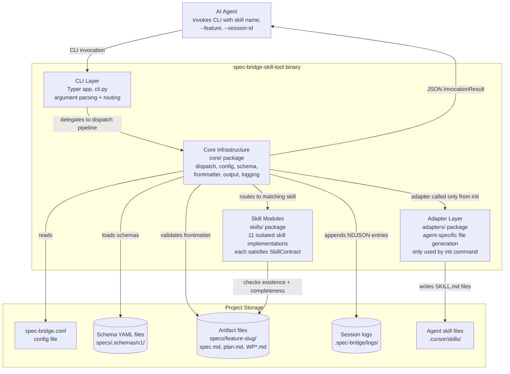
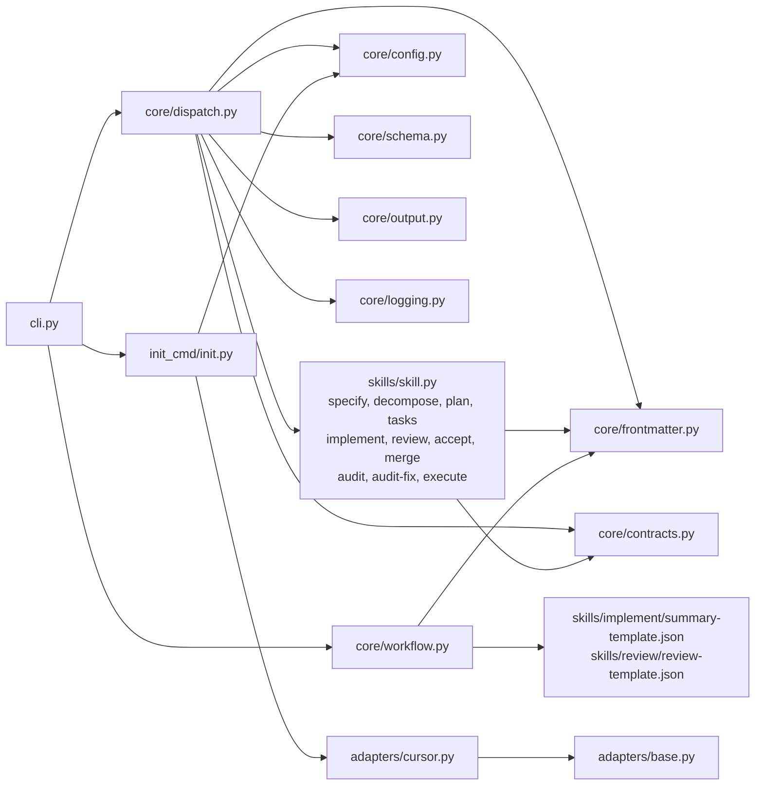

# Architecture Overview

## System Context - C4 Level 1

`spec-bridge-skill-tool` sits at the boundary between human developers and AI agents in an
SDD (Spec-Driven Development) workflow. Developers set up the harness once; AI agents interact
with it on every skill execution. The harness reads artifacts from disk and writes structured
JSON to stdout - it never contacts external services.

---

## Container Architecture - C4 Level 2

The `spec-bridge-skill-tool` binary is composed of four logical containers that collaborate
to produce a validation verdict. All containers run in-process; there are no network calls or
sub-processes.

---

## Component Architecture - C4 Level 3

### Core Package Components

The `core/` package contains all skill-agnostic infrastructure. No skill-specific knowledge
lives here.

```mermaid
graph TB
  subgraph CLI["cli.py"]
    CLIAPP["Typer app<br/>11 sub-commands"]
  end

  subgraph Core["core/ package"]
    DISPATCH["dispatch.py<br/>run_skill()<br/>10-step pipeline"]
    CONFIG["config.py<br/>ProjectConfig<br/>spec-bridge.conf loader"]
    SCHEMA["schema.py<br/>SchemaLoader<br/>YAML to Pydantic model"]
    FRONTMATTER["frontmatter.py<br/>read/write YAML<br/>frontmatter blocks"]
    CONTRACTS["contracts.py<br/>CheckResult<br/>InvocationResult<br/>SkillContract Protocol<br/>SkillOutputContract Protocol"]
    OUTPUT["output.py<br/>CliOutput<br/>JSON stdout emitter"]
    LOGGING["logging.py<br/>SessionLogger<br/>DebugLogEntry<br/>AuditLogEntry"]
    WORKFLOW["workflow.py<br/>spec status lifecycle<br/>JSON-first summaries<br/>versioned review tracking<br/>WP dependency gate"]
  end

  subgraph Skills["skills/ package"]
    SPECIFY["specify/skill.py<br/>SpecifySkill"]
    DECOMPOSE["decompose/skill.py<br/>DecomposeSkill"]
    PLAN["plan/skill.py<br/>PlanSkill"]
    TASKS["tasks/skill.py<br/>TasksSkill"]
    IMPLEMENT["implement/skill.py<br/>ImplementSkill<br/>summary-template.json"]
    REVIEW["review/skill.py<br/>ReviewSkill<br/>review-template.json"]
    ACCEPT["accept/skill.py<br/>AcceptSkill"]
    MERGE["merge/skill.py<br/>MergeSkill"]
    AUDIT["audit/skill.py<br/>AuditSkill<br/>validates questions.md"]
    AUDITFIX["audit_fix/skill.py<br/>AuditFixSkill<br/>validates completion"]
    EXECUTE["execute/<br/>ExecuteOutputContract<br/>checkpoint + report contracts"]
  end

  subgraph Adapters["adapters/ package"]
    BASE["base.py<br/>SKILL_NAMES list"]
    CURSOR["cursor.py<br/>CursorAdapter<br/>SKILL.md generator"]
    TEMPLATES["templates/<br/>per-skill .md files"]
  end

  subgraph InitCmd["init_cmd/ package"]
    INIT["init.py<br/>run_init()<br/>3-step bootstrap"]
    BUNDLEDSCHEMAS["schemas/v1/<br/>spec.yaml, plan.yaml<br/>tasks.yaml, wp.yaml<br/>decomposition.yaml<br/>questions.yaml"]
  end

  CLIAPP -->|"calls run_skill()"| DISPATCH
  CLIAPP -->|"calls workflow utilities"| WORKFLOW
  CLIAPP -->|"calls run_init()"| INIT
  DISPATCH -->|"load_project_config()"| CONFIG
  DISPATCH -->|"SchemaLoader()"| SCHEMA
  DISPATCH -->|"read_frontmatter_only()"| FRONTMATTER
  DISPATCH -->|"skill.run_checks()"| SPECIFY
  DISPATCH -->|"skill.run_checks()"| DECOMPOSE
  DISPATCH -->|"skill.run_checks()"| PLAN
  DISPATCH -->|"skill.run_checks()"| TASKS
  DISPATCH -->|"skill.run_checks()"| IMPLEMENT
  DISPATCH -->|"skill.run_checks()"| REVIEW
  DISPATCH -->|"skill.run_checks()"| ACCEPT
  DISPATCH -->|"skill.run_checks()"| MERGE
  DISPATCH -->|"skill.run_checks()"| AUDIT
  DISPATCH -->|"skill.run_checks()"| AUDITFIX
  DISPATCH -->|"skill.run_checks()"| EXECUTE
  DISPATCH -->|"CheckResult / InvocationResult"| CONTRACTS
  DISPATCH -->|"CliOutput.success/error()"| OUTPUT
  DISPATCH -->|"SessionLogger.append_*()"| LOGGING
  WORKFLOW -->|"reads / writes spec status"| FRONTMATTER
  WORKFLOW -->|"reads JSON templates"| IMPLEMENT
  WORKFLOW -->|"reads JSON templates"| REVIEW
  INIT -->|"CursorAdapter()"| CURSOR
  INIT -->|"copies"| BUNDLEDSCHEMAS
  CURSOR -->|"reads"| TEMPLATES
  CURSOR -->|"SKILL_NAMES"| BASE
```

---

## Architectural Patterns

| Pattern | Where | Description |
|---------|-------|-------------|
| **Protocol-based duck typing** | `core/contracts.py` | `SkillContract` and `SkillOutputContract` are structural protocols -- skills satisfy them without inheriting, enabling independent development |
| **Schema-first, runtime model derivation** | `core/schema.py` | Schema YAML files define artifact shapes; `SchemaLoader` builds Pydantic model classes at runtime via `pydantic.create_model` with caching |
| **Isolated skill modules** | `skills/` | Each skill is a self-contained directory; deleting one cannot break any other at runtime |
| **Adapter pattern** | `adapters/` | Agent-specific file generation is isolated behind `CursorAdapter`; adding a new agent requires only one new file in `adapters/` |
| **Single-pipeline dispatch** | `core/dispatch.py` | All 10 skill sub-commands flow through the same 10-step `run_skill()` pipeline -- consistent validation, logging, and output |
| **Stdout-only JSON output** | `core/output.py` | `CliOutput` emits a single-line JSON `InvocationResult` to stdout; nothing goes to stderr |
| **Session-scoped audit trail** | `core/logging.py` | Every invocation appends a `DebugLogEntry` and `AuditLogEntry` keyed by `--session-id` to NDJSON log files |
| **SyDD misfit decomposition** | `skills/decompose/` | The `decompose` skill inserts a structured misfit analysis step between `specify` and `plan`; validates `decomposition.md` against `decomposition.yaml` schema -- the artifact is the authoritative reference for subsystem boundaries throughout the rest of the workflow |
| **JSON-first skill summaries** | `core/workflow.py` + skill JSON templates | Agents fill a co-located JSON template; the tool validates, renders Markdown, and persists both; Markdown is never parsed -- only the JSON sidecar is machine-read |
| **Versioned review cycle** | `core/workflow.py` | Review summaries are stored as `WP<id>-review-summary-v<N>.json` + `.md`; each round carries a `status` (`requested`, `implemented`, `approved`); the implement skill transitions status before reviewer creates a new version |
| **Audit on-ramp into SDD** | `skills/audit/` + `skills/audit_fix/` | The `audit` skill validates `questions.md` (question catalogue from codebase review); `audit-fix` validates completion (`answered_count == question_count`) and dual-calls `plan` to validate the generated `plan.md`; the resulting plan feeds the standard `tasks` pipeline without modification |
| **spec.md status lifecycle** | `core/workflow.py` | `spec.md` frontmatter tracks `draft` -> `planned` -> `planned_tasks` -> `planned_accepted` -> `implemented`; each skill validates the spec status as a pre-condition gate |
| **Workflow utility sub-commands** | `cli.py` + `core/workflow.py` | Non-validation commands (`generate-implement-summary-template`, `append-implement-summary`, `generate-review-template`, `append-review-summary`, `set-spec-status`, `check-dep-wps-ready`) are thin CLI wrappers over `core/workflow.py` |

---

## Key Design Decisions

### 1. Separate binary, not an extension of spec-bridge v1

- **What**: `spec-bridge-skill-tool` is a new, independently installed package, not a set of
  sub-commands added to the existing `spec-bridge` CLI
- **Why**: The audiences are different (developers vs. AI agents); the release cadences are
  different; and coupling the two creates upgrade pressure in both directions
- **Reference**: [ADR-0001](../adr/0001-spec-bridge-skill-tool-as-separate-binary.md)

### 2. Exactly two responsibilities, constitutionally enforced

- **What**: The tool does only two things: schema validation (pre-condition) and outcome
  verification (post-condition). No auto-fixing, no file generation during validation, no
  orchestration
- **Why**: A read-only harness (post-`init`) makes failures unambiguous -- if the tool exits
  non-zero, the agent's output is always the problem
- **Reference**: [ADR-0002](../adr/0002-two-responsibility-model.md)

### 3. Skill module isolation

- **What**: Each skill lives in its own directory under `skills/`; it may only import from
  `skill_tool.core`; cross-skill imports are forbidden
- **Why**: Prevents accidental coupling, enables parallel development of skills, and makes
  each skill independently testable
- **Reference**: [ADR-0003](../adr/0003-skill-module-isolation.md)

### 4. Schema-first artifact design

- **What**: Schema YAML files under `specs/.schemas/<version>/` are the source of truth for
  artifact frontmatter; Pydantic models are derived at runtime
- **Why**: Artifact contracts are readable by humans and machines without Python knowledge;
  schema changes don't require touching multiple Python files
- **Reference**: [ADR-0004](../adr/0004-schema-first-artifact-design.md)

### 5. Single configuration source

- **What**: `spec-bridge.conf` at the project root is the only configuration file; it is
  absent-safe (all defaults apply)
- **Why**: No hidden config merging, no environment variable overrides, no surprise behaviour
- **Reference**: [ADR-0005](../adr/0005-spec-bridge-conf-single-configuration-source.md)

### 6. Structured stdout-only output

- **What**: All output is a single-line JSON `InvocationResult` on stdout; stderr is never
  written; exit 0 = pass, exit 1 = fail
- **Why**: Compatible with any AI agent execution environment, pipeable to `jq`, testable with
  `capsys`, composable in NDJSON streams
- **Reference**: [ADR-0006](../adr/0006-structured-stdout-only-output.md)

### 7. Adapter pattern for agent file generation

- **What**: The `adapters/` package isolates all agent-specific file generation behind a
  common interface; templates live in `adapters/templates/<skill>.md`
- **Why**: Adding a new agent (e.g., VS Code) requires only one new adapter class and
  registration in `_ADAPTERS` -- no changes to the dispatch pipeline or skill modules
- **Reference**: [ADR-0007](../adr/0007-adapter-pattern-for-agent-specific-file-generation.md)

### 8. SyDD decompose skill as lifecycle extension

- **What**: The `decompose` skill is a new, optional-but-enforced step between `specify` and
  `plan` that validates `decomposition.md` -- a structured document mapping misfits (failure
  scenarios) to subsystems and abstract components
- **Why**: Synthesis-Driven Development requires that architecture emerges from identified
  misfits, not from intuition; the harness enforces this by refusing to let `plan` proceed
  until `decomposition.md` is complete and schema-valid
- **Key additions**: `decomposition.yaml` schema (5 required sections), new advisory checks in
  `specify` (SyDD-S01..S03), `plan` (SyDD-P01..P04), and `tasks` (SyDD-T01..T02)

### 9. Audit on-ramp skills

- **What**: Two new standalone skill modules (`audit`, `audit-fix`) provide a structured on-ramp
  into the SDD workflow for existing codebases. `audit` validates that the AI agent produced a
  complete `questions.md` question catalogue. `audit-fix` validates that all questions are
  answered and that the generated `plan.md` is schema-valid (dual-call: `audit-fix` then `plan`).
- **Why**: Existing codebases need a structured path into SDD without re-writing a spec from
  scratch. The two-skill split enforces the two-responsibility contract: each skill does exactly
  one validation job.
- **Reference**: [ADR-0008](../adr/0008-audit-and-audit-fix-workflows.md)

---

## Module Dependency Map

