# Workflow Overview

## Core Workflows

### Workflow 1: SyDD Lifecycle (Full Feature from Spec to Merge)

The Synthesis-Driven Development lifecycle moves a feature through eight stages. Each stage is
executed by an AI agent following a SKILL.md instruction set, ending with a call to
`spec-bridge-skill-tool` for a deterministic verdict.

The `decompose` skill is unique to the SyDD lifecycle. It sits between `specify` and `plan`
and validates `decomposition.md` -- a structured document that derives subsystem boundaries,
abstract components, and inter-subsystem contracts from identified misfits.

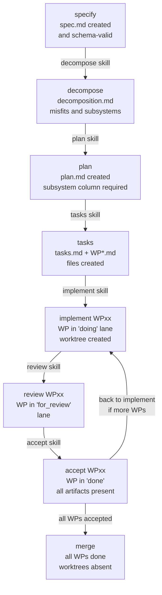

**At each stage**, the AI agent:
1. Reads the matching `SKILL.md` instruction file from `.cursor/skills/spec-bridge-<skill>/`
2. Creates or modifies artifacts on disk according to the instructions
3. Calls `spec-bridge-skill-tool <skill> --feature <slug> --session-id <uuid>`
4. Receives a JSON verdict (exit 0 = pass, exit 1 = fail)
5. If failed: reads the `errors` array and corrects artifacts, then re-invokes

**SyDD validation rules** enforced across the lifecycle:

| Rule ID | Skill | Check | Enforcement |
|---------|-------|-------|-------------|
| SyDD-S01 | `specify` | `body_context_non_empty` -- Context section is non-trivial | Advisory |
| SyDD-S02 | `specify` | `body_misfits_non_empty` -- Misfits section is non-trivial | Advisory |
| SyDD-S03 | `specify` | `body_use_cases_present` -- Use Cases section is non-trivial | Advisory |
| SyDD-D01 | `decompose` | `decomposition-exists` -- `decomposition.md` is present | Blocking |
| SyDD-D02 | `decompose` | `decomposition-frontmatter-valid` -- schema-valid frontmatter | Blocking |
| SyDD-D03 | `decompose` | `decomposition-misfits-non-empty` -- Misfits section filled | Blocking |
| SyDD-D04 | `decompose` | `decomposition-subsystems-non-empty` -- Subsystems section filled | Blocking |
| SyDD-D05 | `decompose` | `decomposition-contracts-non-empty` -- Contracts section filled | Blocking |
| SyDD-P01 | `plan` | `plan-has-decomposition-ref` -- plan references decomposition | Advisory |
| SyDD-P02 | `plan` | `plan-has-abstract-components` -- Abstract Components section filled | Advisory |
| SyDD-P03 | `plan` | `plan-has-contracts-if-multiple` -- Contracts section filled (multi-subsystem) | Advisory |
| SyDD-P04 | `plan` | `plan-has-subsystem-column` -- Work Packages table has Subsystem column | Advisory |
| SyDD-T01 | `tasks` | `wp-has-subsystem-field` -- each WP frontmatter has `subsystem:` field | Advisory |
| SyDD-T02 | `tasks` | `misfit-coverage-section` -- tasks.md has Misfit Coverage section | Advisory |

---

---

### Workflow 2: Audit On-Ramp (Existing Codebase to Plan)

The audit workflow provides a structured on-ramp for existing codebases that do not start from a
blank spec. It produces a `questions.md` question catalogue, resolves each question in an
interactive session, and generates a `plan.md` that feeds directly into the standard `tasks` step.

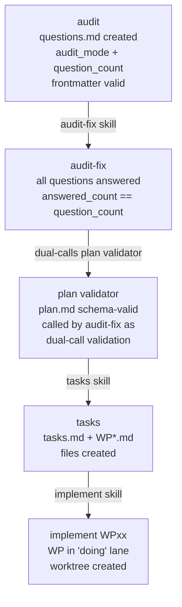

**Phase 1 -- audit**: the AI agent performs a structured codebase review (12 review dimensions)
and writes findings as structured questions in `questions.md`. Each question carries:
- `Where`: specific code location
- `Why this matters`: risk or impact
- `Question`: exact question asked of the codebase owner
- `Recommendation`: suggested resolution
- `Answer:` (blank -- filled during audit-fix)

Two audit modes are supported:
- `review` -- agent generates questions from scratch via the 12-dimension review
- `import` -- agent normalises an existing review document into the canonical format

**Phase 2 -- audit-fix**: the AI agent presents questions one at a time to the developer.
Valid verdicts are: `intended behavior`, `bug`, `approved improvement`, `deferred`, `out-of-scope`.
The agent:
1. Presents one question per turn, ending each with `WAITING_FOR_VERDICT`
2. Handles research detours inline (Exa, Context7, code-vectorizer) while waiting for the verdict
3. Writes the verdict into the `Answer:` field and increments `answered_count` after each question
4. Filters by verdict (`bug` / `approved improvement` -> WP candidates; `deferred` -> Open Questions)
5. Generates `plan.md` from the plan template with traceability link to `questions.md`
6. Calls `spec-bridge-skill-tool audit-fix` (completion check) then `spec-bridge-skill-tool plan`
   (schema check) -- dual-call validation

**Dual-call validation sequence**:

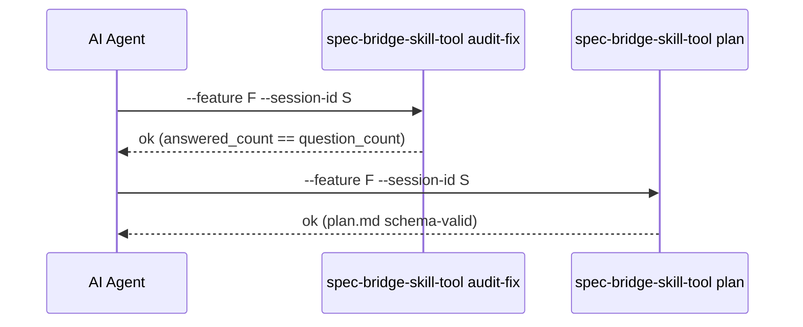

---

### Workflow 3: Automated WP Execution (`execute`)

The `execute` skill runs all planned work packages sequentially without manual intervention.
It drives the `implement → review` loop for each WP and produces a checkpoint file (for crash
recovery) plus a final execution report.

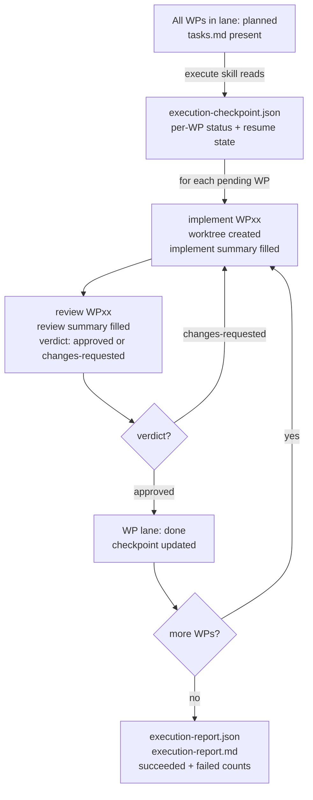

**Artifacts produced**:

| Artifact | Location | Purpose |
|----------|----------|---------|
| `execution-checkpoint.json` | `specs/<feature>/` | Crash-recovery state: per-WP `status`, timestamps, review verdict |
| `execution-report.json` | `specs/<feature>/` | Final structured report: `ExecutionReport` model with per-WP results, warnings, uncaught errors |
| `execution-report.md` | `specs/<feature>/` | Human-readable rendering of the execution report |
| `logs/execution.log` | `specs/<feature>/` | Main orchestration log |
| `logs/WPxx.log` | `specs/<feature>/` | Per-WP log for each processed work package |

**WP status states** (tracked in checkpoint):

| Status | Meaning |
|--------|---------|
| `pending` | Not yet started |
| `implementing` | implement skill in progress |
| `impl_done` | implement skill passed, awaiting review |
| `reviewing` | review skill in progress |
| `done` | review approved, WP complete |
| `failed` | implement or review skill exited non-zero |

**Resume behaviour**: if interrupted, re-running `execute` reads the checkpoint and skips WPs
already in `done` or `failed`, resuming from the first `pending` or in-progress WP.

> **Implementation status**: `execute` contracts and data models (`contracts.py`, `helpers.py`,
> `state_validator.py`, `checkpoint.py`, `report_generator.py`) are complete from WP01.
> The orchestration loop (full workflow automation) is being implemented in WP02.

---

### Workflow 4: Project Initialisation (`init`)

The `init` command is the only command that modifies disk state beyond logging. It is
safe to re-run (idempotent for schemas; always regenerates skill files).

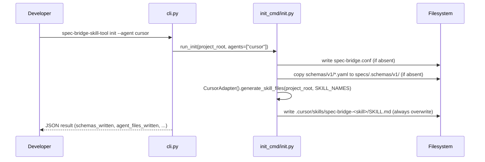

**Steps in `run_init()`**:
1. Write `spec-bridge.conf` if absent (config-once: respects user modifications)
2. Copy bundled schema YAML files to `specs/.schemas/v1/` (idempotent: skipped if exists)
3. Generate agent skill instruction files (regenerative: always overwrites to stay in sync)

---

### Workflow 5: Skill Dispatch Pipeline (10 Steps)

Every skill sub-command (except `init`) flows through the same `run_skill()` dispatch
pipeline in `core/dispatch.py`. This ensures consistent validation, output, and logging
regardless of which skill is invoked.

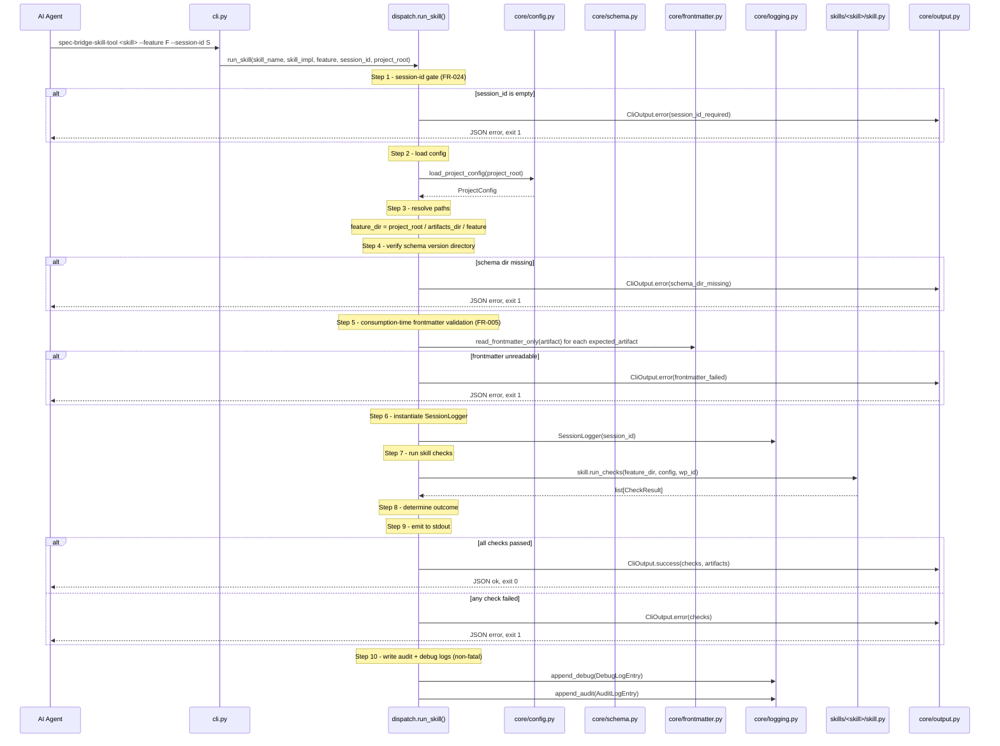

---

### Workflow 6: Schema Loading and Validation

Schema loading is lazy and cached. The `SchemaLoader` reads YAML files on first use and
caches the derived Pydantic model class for the lifetime of the process.

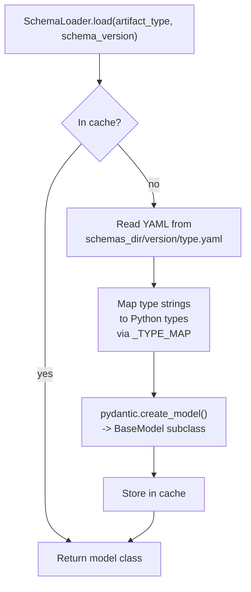

**Type mapping** (`str` -> Python type):

| YAML type | Python type |
|-----------|-------------|
| `str` | `str` |
| `int` | `int` |
| `float` | `float` |
| `bool` | `bool` |
| `list` | `list` |
| `dict` | `dict` |

---

## Data Flow

### Artifact Frontmatter Contract

Artifacts are markdown files with YAML frontmatter. The schema YAML files define which
frontmatter fields are required, optional, and their types.

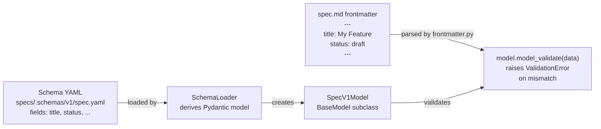

### Output Envelope

Every invocation produces exactly one JSON object on stdout:

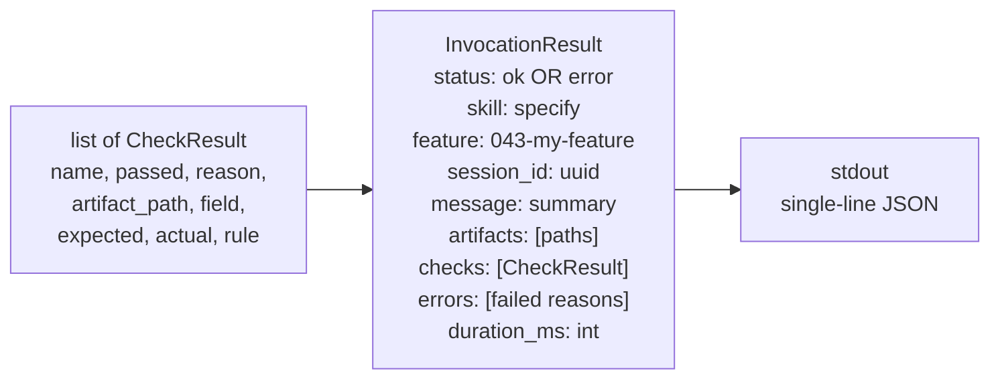

---

### Workflow 7: JSON-First Implement Summary

After writing code, the AI agent creates a structured JSON summary rather than free-form prose.
The tool validates the JSON and renders both a persisted Markdown section and a stored JSON sidecar.

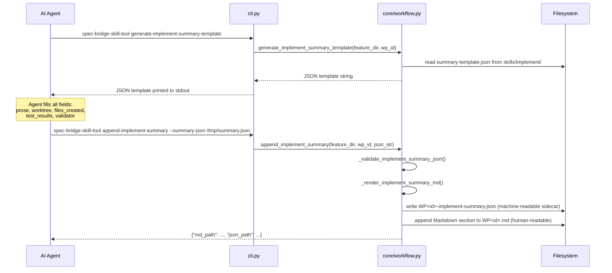

---

### Workflow 8: Versioned Review Summary Cycle

The review skill maintains a versioned set of review summaries. The cycle advances through
`requested` -> `implemented` -> re-review, repeating until `approved`.

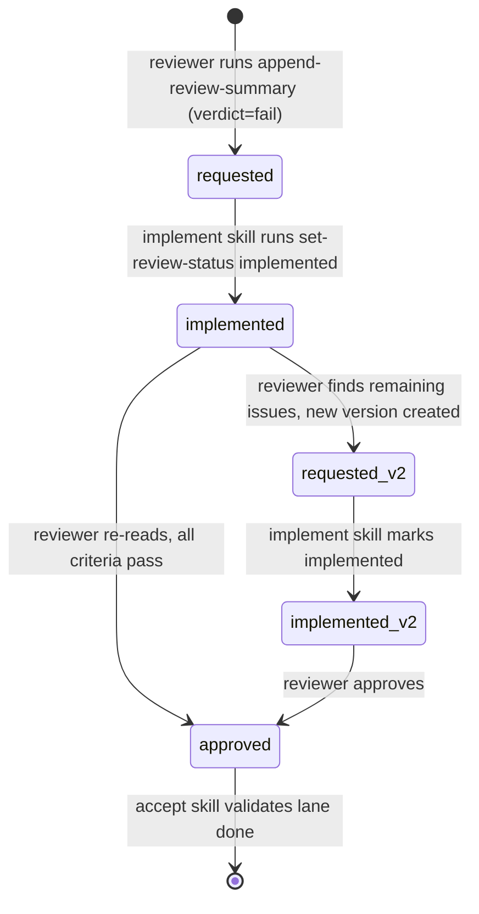

**Key rules enforced by `core/workflow.py`**:
- If a `requested` review exists, the review skill must NOT create a new version -- it must
  check whether the implemented changes resolved the issues instead
- When the implement skill addresses changes, it calls `set-review-status implemented` to
  transition the current version from `requested` to `implemented`
- When the reviewer finds remaining unresolved issues, `append-review-summary` creates
  `v<N+1>` with `status: requested`
- When all criteria pass, `append-review-summary` sets `status: approved` (no new version needed)

---

## State Management

State is entirely file-system based. There is no in-memory state shared between invocations
beyond the schema cache (which lives only for the duration of a single process invocation).

| State type | Location | Format | Mutated by |
|------------|----------|--------|------------|
| Project config | `spec-bridge.conf` | YAML | `init` (once) |
| Artifact schemas | `specs/.schemas/v1/` | YAML | `init` (once) |
| Feature artifacts | `specs/<feature-slug>/` | YAML-frontmatter Markdown | AI agent |
| spec.md status | frontmatter `status:` in `spec.md` | YAML | `set-spec-status` workflow command |
| Decomposition artifact | `specs/<feature-slug>/decomposition.md` | YAML-frontmatter Markdown | AI agent (decompose skill) |
| Audit questions | `specs/<feature-slug>/questions.md` | YAML-frontmatter Markdown | AI agent (audit skill; audit-fix skill fills Answer: fields) |
| questions.md answered_count | frontmatter `answered_count:` in `questions.md` | YAML | AI agent (incremented after each verdict in audit-fix) |
| WP lane | frontmatter `lane:` field in WP files | YAML | Skill modules (read-only); AI agent (writes) |
| WP subsystem | frontmatter `subsystem:` field in WP files | YAML | AI agent (optional; enforced as advisory) |
| Implement summary | `tasks/WP<id>-implement-summary.json` + `.md section` | JSON + Markdown | `append-implement-summary` workflow command |
| Review summary | `tasks/WP<id>-review-summary-v<N>.json` + `.md section` | JSON + Markdown | `append-review-summary` workflow command |
| Review status | `status:` field in review summary JSON | JSON field | `set-review-status` + `append-review-summary` |
| Session debug log | `.spec-bridge/logs/<session-id>.debug.ndjson` | NDJSON | `dispatch` (append) |
| Session audit log | `.spec-bridge/logs/<session-id>.audit.ndjson` | NDJSON | `dispatch` (append) |

---

## Error Handling

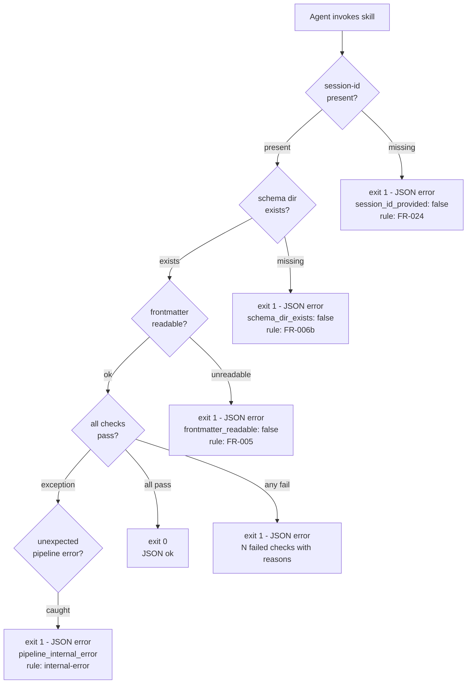

**Key invariant**: every failure path produces a JSON object on stdout containing a `checks`
array with `passed: false` entries and human-readable `reason` strings. The AI agent reads
`errors` (derived from failed check reasons) to understand what to fix.
