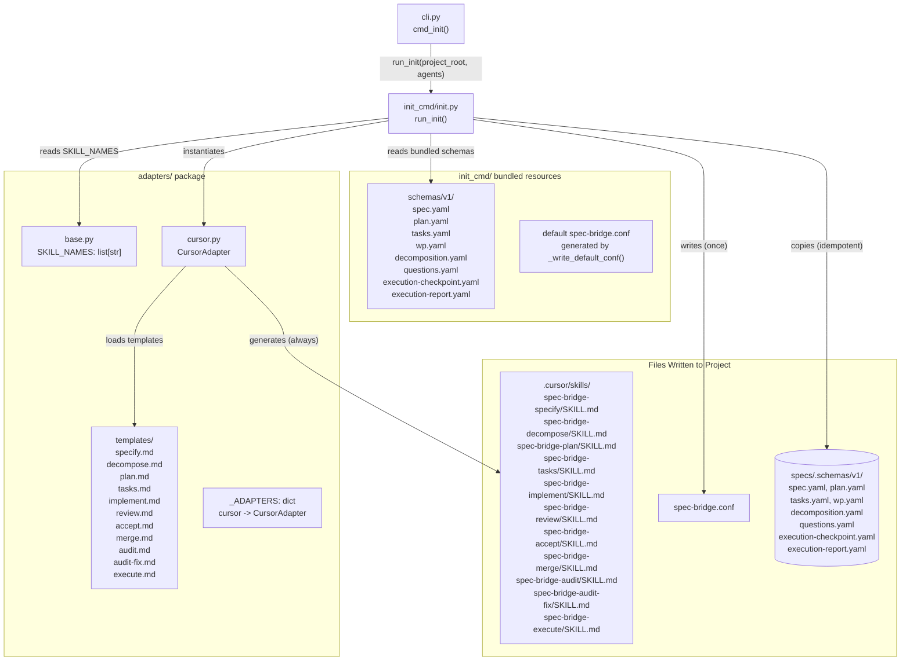
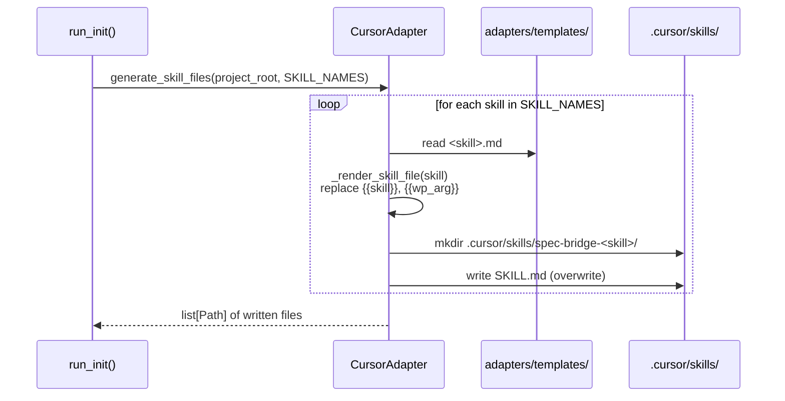

# Deep Dive: Adapter Layer and Init Command

## Overview

The adapter layer (`adapters/`) and the init command (`init_cmd/`) work together to bootstrap
a project for use with `spec-bridge-skill-tool`. They are the only components that write to
disk beyond the session logs, and they are only active during the `init` sub-command.

**Key distinction**: the adapter layer and init command are completely separate from the
validation pipeline. They never participate in schema loading or outcome verification.

---

## Architecture



---

## `init_cmd/init.py` - Three-Step Bootstrap

`run_init()` performs three operations in a fixed order:

### Step 1: Write `spec-bridge.conf` (config-once)

- Written only if absent. If the file already exists, it is never overwritten.
- This "config-once" behaviour means users can safely edit `spec-bridge.conf` without fear
  that `init` will reset their changes.
- The generated file contains all `ProjectConfig` fields explicitly (not just non-defaults)
  so users can see every available option.

### Step 2: Copy schema YAML files (idempotent)

- Target: `<artifacts_dir>/.schemas/<schema_version>/` (default: `specs/.schemas/v1/`)
- Source: `init_cmd/schemas/v1/` bundled with the package
- **Idempotent**: if the target directory already exists, the copy is skipped entirely and
  `schemas_skipped: true` is set in the return value.
- This means a second `init` run will never overwrite user-modified schemas.

### Step 3: Generate agent skill instruction files (regenerative)

- Agent adapters registered in `_ADAPTERS` dict (currently only `cursor`)
- For each configured agent: `adapter.generate_skill_files(project_root, SKILL_NAMES)`
- **Always overwrites** existing SKILL.md files to stay in sync with current templates.
- This is intentionally asymmetric with step 2: schemas are stable contracts, skill files
  are instructions that should always reflect the latest templates.

**Return value structure**:
```json
{
  "schemas_written": ["specs/.schemas/v1/spec.yaml", "..."],
  "schemas_skipped": false,
  "agent_files_written": [".cursor/skills/spec-bridge-specify/SKILL.md", "..."],
  "config_written": "spec-bridge.conf"
}
```

---

## `adapters/cursor.py` - CursorAdapter

The `CursorAdapter` generates Cursor IDE skill instruction files following the
[agentskills.io](https://agentskills.io) folder-per-skill convention.

### Output structure

```
.cursor/skills/
+-- spec-bridge-specify/
|   +-- SKILL.md       <- instruction file for the specify skill
+-- spec-bridge-decompose/
|   +-- SKILL.md       <- SyDD misfit analysis and decomposition instructions
+-- spec-bridge-plan/
|   +-- SKILL.md
+-- spec-bridge-tasks/
|   +-- SKILL.md
+-- spec-bridge-implement/
|   +-- SKILL.md
+-- spec-bridge-review/
|   +-- SKILL.md
+-- spec-bridge-accept/
|   +-- SKILL.md
+-- spec-bridge-merge/
|   +-- SKILL.md
+-- spec-bridge-audit/
|   +-- SKILL.md       <- codebase review on-ramp instructions
+-- spec-bridge-audit-fix/
|   +-- SKILL.md       <- question resolution and plan generation instructions
+-- spec-bridge-execute/
|   +-- SKILL.md       <- automated WP loop instructions
```

### Template rendering

Each SKILL.md is generated from a template file in `adapters/templates/<skill>.md`.
Two placeholders are substituted at generation time:

| Placeholder | Replaced with |
|-------------|---------------|
| `{{skill}}` | The skill name (e.g., `specify`) |
| `{{wp_arg}}` | ` --wp-id <WP-ID>` for `implement`, `review`, `accept`; empty string otherwise |

All other `{` and `}` characters in templates are passed through unchanged (no f-string
escaping issues).

### `generate_skill_files()` sequence



### `delete_skill_files()` - Cleanup

Removes the entire `spec-bridge-<skill>/` directory (not just the SKILL.md). Called when
a skill is removed from the tool or an agent is de-configured.

---

## Bundled Schema YAML Files

Eight schema files are bundled in `init_cmd/schemas/v1/`:

| File | Artifact type | Used by skills |
|------|--------------|----------------|
| `spec.yaml` | Feature specification | `specify` |
| `decomposition.yaml` | Misfit decomposition document | `decompose` |
| `plan.yaml` | Implementation plan | `plan` |
| `tasks.yaml` | Work package index | `tasks` |
| `wp.yaml` | Individual work package | `tasks`, `implement`, `review`, `accept`, `merge` |
| `questions.yaml` | Audit question catalogue | `audit`, `audit-fix` |
| `execution-checkpoint.yaml` | Execute skill crash-recovery state | `execute` |
| `execution-report.yaml` | Execute skill final results report | `execute` |

`decomposition.yaml` introduces three required frontmatter fields (`feature`, `misfits_count`,
`subsystems_count`) and five required markdown body sections (Misfits, Subsystems, Abstract
Components, Inter-Subsystem Contracts, and Test-Seed Misfits). `wp.yaml` was extended with
three optional SyDD fields: `subsystem` (string), `misfit_ids` (list), and
`abstract_components` (list).

**Schema YAML format** (example from `wp.yaml`):

```yaml
fields:
  - name: work_package_id
    type: str
    required: true
  - name: title
    type: str
    required: true
  - name: lane
    type: str
    required: true
  - name: dependencies
    type: list
    required: false
    default: []
```

This format is intentionally simple: a list of field descriptors with `name`, `type`,
`required`, and optional `default`. The `SchemaLoader` in `core/schema.py` derives the
Pydantic model class from this at runtime.

---

## Registering a New Agent Adapter

To add support for a new AI agent (e.g., VS Code Copilot):

1. **Create `adapters/vscodec.py`** with a class that implements:
   - `agent_key = "vscode"`
   - `agent_display_name = "VS Code Copilot"`
   - `skill_dir_relative = Path(".vscode") / "agent-skills"`
   - `generate_skill_files(project_root, skills) -> list[Path]`
   - `delete_skill_files(project_root, skills) -> list[Path]`

2. **Add templates** in `adapters/templates/` (or reuse existing ones if format is identical)

3. **Register in `init_cmd/init.py`**:
   ```python
   _ADAPTERS: dict[str, type] = {
       "cursor": CursorAdapter,
       "vscode": VsCodeAdapter,  # add here
   }
   ```

4. **Write tests** in `tests/test_adapters_vscodec.py` covering:
   - File generation with correct paths
   - Template rendering with `{{skill}}` and `{{wp_arg}}` substitution
   - Idempotent `generate_skill_files()` (safe to call twice)
   - `delete_skill_files()` removes correct directories

No changes to the dispatch pipeline, skill modules, or core infrastructure are required.

---

## Dependencies

**`adapters/`**:
- Standard library only (`pathlib`, `shutil`)
- No external imports

**`init_cmd/`**:
- `ruamel.yaml` - writes `spec-bridge.conf` with YAML formatting
- `skill_tool.adapters.base` - `SKILL_NAMES` list
- `skill_tool.adapters.cursor` - `CursorAdapter`
- `skill_tool.core.config` - `ProjectConfig` for defaults

---

## Testing

| Test file | Coverage |
|-----------|----------|
| `tests/test_adapters_cursor.py` | Template loading, `{{skill}}`/`{{wp_arg}}` substitution, file paths, idempotency |
| `tests/test_init_command.py` | All 3 init steps, config-once behaviour, schema skip-if-exists, `schemas_skipped` flag, unknown agent error |

---

## Potential Improvements

- **Multi-agent init**: the `_ADAPTERS` registry and `--agent` flag already support multiple
  agents; adding agents beyond Cursor requires only new adapter classes
- **Schema versioning migration**: when `v2` schemas are introduced, `init` could be extended
  to detect the current installed version and migrate `specs/.schemas/v1/` -> `v2/`
  automatically (similar to spec-bridge v1's migration system)
- **Template hot-reload during development**: currently templates are read fresh from disk
  on every `generate_skill_files()` call (no template caching), which is already friendly
  to development iteration
