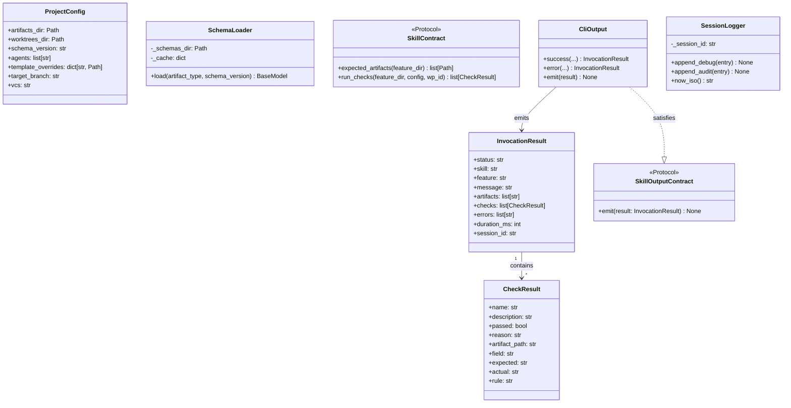

# Deep Dive: Core Module

## Overview

The `core/` package is the shared infrastructure backbone of `spec-bridge-skill-tool`. It
contains everything that is skill-agnostic: dispatch logic, configuration loading, schema
loading, frontmatter parsing, output formatting, and session logging. No skill-specific
knowledge lives here.

**Absolute rule**: code in `core/` must never import from any skill module. Skills import
from `core/`; the reverse is forbidden.

---

## Responsibilities

- **Dispatch**: route CLI invocations through the 10-step validation pipeline
- **Config**: load and validate `spec-bridge.conf` with sensible defaults
- **Schema**: load versioned YAML schema files and derive Pydantic model classes (cached)
- **Frontmatter**: read and write YAML frontmatter blocks from markdown files
- **Contracts**: define the data shapes and protocols that bind core and skills together
- **Output**: emit `InvocationResult` as a single-line JSON object on stdout
- **Logging**: append debug and audit log entries keyed by `--session-id`
- **Workflow utilities**: spec status lifecycle management, JSON-first skill summaries,
  versioned review tracking, and WP dependency gate (`workflow.py`)

---

## Architecture



---

## Key Files

| File | Purpose |
|------|---------|
| `config.py` | Loads `spec-bridge.conf` via `ruamel.yaml`, validates into `ProjectConfig` Pydantic model. Absent file returns all-defaults silently |
| `contracts.py` | Defines `CheckResult`, `InvocationResult` (Pydantic v2 models) and `SkillContract`, `SkillOutputContract` (structural Protocols) |
| `dispatch.py` | Implements `run_skill()` - the single 10-step pipeline shared by all 8 skill sub-commands |
| `frontmatter.py` | Reads and writes YAML frontmatter blocks from/to markdown files using `ruamel.yaml` |
| `schema.py` | `SchemaLoader`: reads YAML schema files, maps type strings to Python types, calls `pydantic.create_model()`, caches results |
| `output.py` | `CliOutput`: static factory methods `success()` and `error()` that build and `typer.echo()` a JSON `InvocationResult` |
| `logging.py` | `SessionLogger`: appends `DebugLogEntry` and `AuditLogEntry` NDJSON entries to per-session log files (failures are non-fatal) |
| `workflow.py` | SDD workflow utilities: spec status lifecycle, JSON-first implement and review summaries, versioned review tracking, WP dependency checks |

---

## Implementation Details

### `dispatch.py` - The 10-Step Pipeline

Every skill invocation (except `init`) flows through exactly these 10 steps:

```
Step 1  - session-id gate          (FR-024)   → exit 1 if missing
Step 2  - load config              (FR-006)   → ProjectConfig from spec-bridge.conf
Step 3  - resolve paths                       → feature_dir, schemas_dir
Step 4  - verify schema version dir (FR-006b) → exit 1 if missing
Step 5  - frontmatter validation   (FR-005)   → exit 1 if unreadable
Step 6  - init SessionLogger
Step 7  - skill.run_checks()
Step 8  - determine outcome (all_passed?)
Step 9  - emit InvocationResult as JSON       → exit 0 or exit 1
Step 10 - write debug + audit logs (non-fatal, FR-024a)
```

**Critical invariant**: step 1 (session-id) is checked before any disk access. If it fails,
no config is loaded, no schemas are checked, no logs are written.

**Step 5 detail**: `_validate_input_artifacts()` calls `skill.expected_artifacts(feature_dir)`
to get the list of artifacts the skill will consume, then tries to read the YAML frontmatter
of each one that exists on disk. Artifacts that don't exist are skipped (existence is checked
by `skill.run_checks()` in step 7).

### `schema.py` - Runtime Model Derivation

```python
# YAML schema file (specs/.schemas/v1/spec.yaml)
fields:
  - name: title
    type: str
    required: true
  - name: status
    type: str
    required: false
    default: draft

# Derived Pydantic model (equivalent)
class SpecV1Model(BaseModel):
    title: str
    status: str = Field(default="draft")
```

The `SchemaLoader` maps YAML `type` strings to Python types via `_TYPE_MAP`. Unknown type
strings raise `ValueError` immediately -- this is a programming error, not a user error.

The cache key is `(artifact_type, schema_version)` -- a tuple. Cache entries are never
invalidated within a process (safe because schema files don't change during a run).

### `contracts.py` - Protocol-Based Coupling

`SkillContract` is a `typing.Protocol`:

```python
class SkillContract(Protocol):
    def expected_artifacts(self, feature_dir: Path) -> list[Path]: ...
    def run_checks(self, feature_dir, config, wp_id=None) -> list[CheckResult]: ...
```

Any class with these two methods satisfies the protocol without inheriting. This means:
- Skills can be developed without importing from `core/contracts.py` (though they do for `CheckResult`)
- The dispatch layer can route to any conforming object
- Tests can use mock objects that satisfy the protocol trivially

### `workflow.py` - SDD Workflow Utilities

`workflow.py` provides all the business logic for the non-validation CLI sub-commands. It is
the single place where spec status lifecycle, JSON-first summaries, and versioned review tracking
are implemented. The CLI layer in `cli.py` contains thin wrappers that call these functions and
format errors as JSON.

**Spec status lifecycle**:

```
draft  ->  planned  ->  planned_tasks  ->  planned_accepted  ->  implemented
  set by:   plan       tasks            accept               merge
  gate for: plan       tasks            implement (read-only) merge
```

`get_spec_status(feature_dir)` reads the `status:` field from `spec.md` frontmatter.
`set_spec_status(feature_dir, status)` writes the new value using `ruamel.yaml` to preserve
all other frontmatter intact. Skills call `spec-bridge-skill-tool set-spec-status` at the end
of their instruction set after the tool returns exit 0.

**WP dependency gate** (`check_dep_wps_ready`):

Reads the `dependencies:` list from a WP's frontmatter, then checks each dependency WP's
`lane:` field. Returns a list of dicts for any dependency not yet in `lane: done`. The
`implement` skill instruction set calls `check-dep-wps-ready` before creating the worktree;
if any unready dependencies are returned, the agent halts and informs the developer.

**JSON-first implement summary**:

| Function | Role |
|----------|------|
| `generate_implement_summary_template(feature_dir, wp_id)` | Reads `skills/implement/summary-template.json` and returns it as a JSON string for the agent to fill |
| `_validate_implement_summary_json(data)` | Returns an error string if required fields are missing or contain unfilled `<placeholder>` values |
| `_render_implement_summary_md(data)` | Converts the validated JSON dict to a Markdown section string |
| `append_implement_summary(feature_dir, wp_id, json_str)` | Validates, renders, writes JSON sidecar (`WP<id>-implement-summary.json`) and appends Markdown section to the WP file |
| `check_implement_summary_complete(feature_dir, wp_id)` | Returns an error string if the JSON sidecar does not exist or has unfilled placeholders |

**Versioned review summaries**:

| Function | Role |
|----------|------|
| `get_latest_review_summary(feature_dir, wp_id)` | Returns the JSON dict of the highest-versioned review summary file, or `None` if none exist |
| `generate_review_template(feature_dir, wp_id)` | Reads `skills/review/review-template.json`, populates `criteria[]` from the WP's acceptance criteria, populates `_previous_verdict` from the latest review if one exists, and returns the template as a JSON string |
| `_validate_review_json(data)` | Returns an error string if any criterion has an empty verdict or if the closing field is unfilled |
| `_render_review_summary_md(data, version)` | Renders the criteria table, the `### Issues` section (with severity, description, fix, misfits, subtasks, files per issue), and the `### Dependency Notes` section |
| `append_review_summary(feature_dir, wp_id, json_str)` | Validates, determines `status` (approved / requested), renders Markdown, writes JSON sidecar and appends Markdown section; creates a new version if needed |
| `set_review_status(feature_dir, wp_id, status)` | Finds the latest review summary JSON and updates its `status:` field in both the JSON sidecar and the Markdown body |
| `check_review_summary_complete(feature_dir, wp_id)` | Returns an error string if no review JSON exists or if all verdicts are not filled |

**Review issues structure** (in `generate_review_template` / `_render_review_summary_md`):

Each entry in `issues[]` carries:
- `id` -- human-readable identifier (`"Issue 1"`)
- `severity` -- one of `critical`, `major`, `minor`, `info`
- `title` -- short, actionable title
- `description` -- detailed description
- `fix` -- suggested fix (prose or code snippet)
- `misfits[]` -- misfit IDs from the WP this issue relates to
- `subtasks[]` -- WP IDs affected or needing re-run
- `affected_files[]` -- file paths involved

A top-level `dependency_notes` field captures inter-WP dependency impacts (e.g., "WP05 must
re-merge WP04 after fix").

### `logging.py` - Non-Fatal Audit Trail

Log entries are written in steps 10 of the dispatch pipeline. Both `append_debug()` and
`append_audit()` are wrapped in `try/except Exception: pass` -- logging failures are
explicitly non-fatal (`FR-024a`). This means a full disk or permission error on the log
directory never causes a skill invocation to fail.

Log files:
- Debug: `.spec-bridge/logs/<session-id>.debug.ndjson` - one JSON line per invocation with
  full step trace, config, and duration
- Audit: `.spec-bridge/logs/<session-id>.audit.ndjson` - one JSON line per invocation with
  outcome summary and check results

---

## Dependencies

**Internal**: `core/` has no imports from `skills/` or `adapters/`

**External**:
- `typer` - output via `typer.echo()` (ensures consistent encoding)
- `pydantic` - `BaseModel`, `Field`, `create_model`, `field_validator`
- `ruamel.yaml` - frontmatter parsing (preserves comments and ordering)
- `pyyaml` - schema file loading (simpler API for non-frontmatter YAML)

---

## Testing

The `tests/` directory at `skill-tool/tests/` covers the core module with dedicated files:

| Test file | Coverage |
|-----------|----------|
| `test_core_config.py` | `ProjectConfig` defaults, absent file warning, malformed YAML exits |
| `test_core_contracts.py` | `CheckResult` validation, `InvocationResult` structure, protocol satisfaction |
| `test_core_schema.py` | `SchemaLoader.load()` caching, type mapping, missing file error |
| `test_core_frontmatter.py` | Frontmatter read/write round-trips, missing frontmatter handling |
| `test_core_output.py` | `CliOutput.success()` and `error()` JSON output, `errors` derivation |
| `test_core_logging.py` | `SessionLogger` append behaviour, non-fatal failure on bad path |
| `test_workflow_commands.py` | All `workflow.py` functions: spec status lifecycle, implement summary (generate / validate / render / append / check), review summary (generate / validate / render / append / check), issues rendering, dependency_notes, versioned review cycle, WP dependency gate |

---

## Potential Improvements

- **Schema validation at consumption time** (step 5) currently only checks readability, not
  full Pydantic validation. Full consumption-time validation would catch schema mismatches
  before step 7 runs, making error messages earlier and more precise
- **Multiple schema version support**: `SchemaLoader` already supports multiple versions via
  the cache key; the dispatch pipeline could be extended to negotiate the version from
  artifact frontmatter rather than always using the project default
- **Structured log querying**: the NDJSON audit log is append-only today; a `logs` sub-command
  could filter by feature, skill, session, or outcome for developer diagnostics
