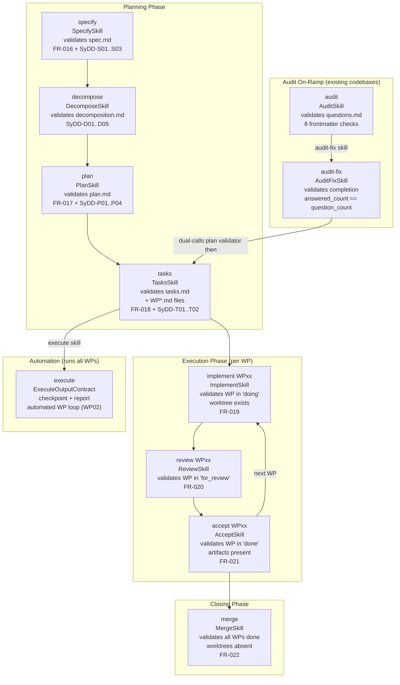
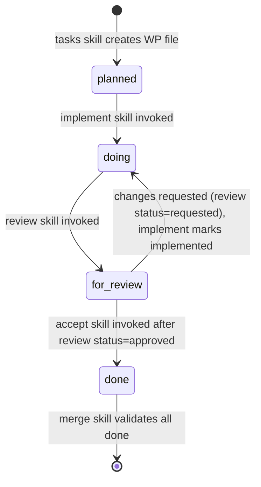

# Deep Dive: Skill Modules

## Overview

The `skills/` package contains eleven isolated skill modules: eight for the core SyDD workflow
steps, two for the audit on-ramp workflow (`audit`, `audit-fix`), and one for automated WP
execution (`execute`).
Each module lives in its own subdirectory and implements `SkillContract` -- the two-method
protocol that the dispatch pipeline calls.

**Isolation rule**: skill modules may only import from `skill_tool.core`. Cross-skill imports
are forbidden. Deleting any single skill module must not cause a runtime error in any other
skill.

---

## Responsibilities

Each skill module is responsible for exactly two things (mirroring the tool's two-responsibility
contract):

1. **`expected_artifacts(feature_dir)`** - declare which artifact paths the skill produces or
   consumes (used by the dispatch pipeline for consumption-time frontmatter validation)
2. **`run_checks(feature_dir, config, wp_id)`** - execute all validation checks and return a
   `list[CheckResult]`, one entry per rule; must never raise - all exceptions are caught and
   returned as failing `CheckResult` entries with `rule="internal-error"`

---

## Skill-to-Stage Mapping



---

## Architecture

```mermaid
classDiagram
  class SkillContract {
    <<Protocol>>
    +expected_artifacts(feature_dir: Path) list[Path]
    +run_checks(feature_dir, config, wp_id) list[CheckResult]
  }

  class SpecifySkill {
    +expected_artifacts(feature_dir) list[Path]
    +run_checks(feature_dir, config, wp_id) list[CheckResult]
    -_check_spec_exists(feature_dir) CheckResult
    -_check_spec_sections(feature_dir) CheckResult
    -_check_spec_frontmatter(feature_dir, config) list[CheckResult]
    -_check_body_context_non_empty(feature_dir) CheckResult
    -_check_body_misfits_non_empty(feature_dir) CheckResult
    -_check_body_use_cases_present(feature_dir) CheckResult
  }

  class DecomposeSkill {
    +expected_artifacts(feature_dir) list[Path]
    +run_checks(feature_dir, config, wp_id) list[CheckResult]
    -_check_decomposition_exists(feature_dir) CheckResult
    -_check_decomposition_frontmatter(feature_dir, config) list[CheckResult]
    -_check_misfits_non_empty(feature_dir) CheckResult
    -_check_subsystems_non_empty(feature_dir) CheckResult
    -_check_contracts_non_empty(feature_dir) CheckResult
  }

  class PlanSkill {
    +expected_artifacts(feature_dir) list[Path]
    +run_checks(feature_dir, config, wp_id) list[CheckResult]
    -_check_plan_exists(feature_dir) CheckResult
    -_check_plan_sections(feature_dir) CheckResult
  }

  class TasksSkill {
    +expected_artifacts(feature_dir) list[Path]
    +run_checks(feature_dir, config, wp_id) list[CheckResult]
    -_check_tasks_md_exists(feature_dir) CheckResult
    -_check_wp_files_exist(feature_dir) list[CheckResult]
    -_check_wp_frontmatter(feature_dir, config) list[CheckResult]
  }

  class ImplementSkill {
    +expected_artifacts(feature_dir) list[Path]
    +run_checks(feature_dir, config, wp_id) list[CheckResult]
    -_check_wp_lane(feature_dir, wp_id) CheckResult
    -_check_worktree_exists(feature_dir, config, wp_id) CheckResult
  }

  class ReviewSkill {
    +expected_artifacts(feature_dir) list[Path]
    +run_checks(feature_dir, config, wp_id) list[CheckResult]
    -_check_wp_lane(feature_dir, wp_id) CheckResult
  }

  class AcceptSkill {
    +expected_artifacts(feature_dir) list[Path]
    +run_checks(feature_dir, config, wp_id) list[CheckResult]
    -_check_wp_lane(feature_dir, wp_id) CheckResult
    -_check_artifacts_present(feature_dir, wp_id) list[CheckResult]
  }

  class MergeSkill {
    +expected_artifacts(feature_dir) list[Path]
    +run_checks(feature_dir, config, wp_id) list[CheckResult]
    -_check_all_wps_done(feature_dir) CheckResult
    -_check_worktrees_absent(feature_dir, config) CheckResult
  }

  SpecifySkill ..|> SkillContract
  DecomposeSkill ..|> SkillContract
  PlanSkill ..|> SkillContract
  TasksSkill ..|> SkillContract
  ImplementSkill ..|> SkillContract
  ReviewSkill ..|> SkillContract
  AcceptSkill ..|> SkillContract
  class AuditSkill {
    +expected_artifacts(feature_dir) list[Path]
    +run_checks(feature_dir, config, wp_id) list[CheckResult]
    -_check_questions_exists(questions_path) CheckResult
    -_check_questions_readable(questions_path) CheckResult
    -_check_frontmatter_present(meta) CheckResult
    -_check_feature_slug(meta) CheckResult
    -_check_feature_slug_format(meta) CheckResult
    -_check_question_count(meta) CheckResult
    -_check_answered_count_sane(meta) CheckResult
    -_check_audit_mode(meta) CheckResult
  }

  class AuditFixSkill {
    +expected_artifacts(feature_dir) list[Path]
    +run_checks(feature_dir, config, wp_id) list[CheckResult]
    -_check_questions_exists(questions_path) CheckResult
    -_check_questions_readable(questions_path) CheckResult
    -_check_frontmatter_present(meta) CheckResult
    -_check_questions_fully_answered(meta) CheckResult
  }

  class ExecuteOutputContract {
    +run_checks(feature_dir, metadata) list[CheckResult]
    -checkpoint: Checkpoint
    -report: ExecutionReport
  }

  MergeSkill ..|> SkillContract
  AuditSkill ..|> SkillContract
  AuditFixSkill ..|> SkillContract
  ExecuteOutputContract ..|> SkillContract
```



---

## Key Files

Each skill directory contains:

| File | Purpose |
|------|---------|
| `skill.py` | Skill implementation: `expected_artifacts()` + `run_checks()` |
| `template.md` | (for planning skills) The markdown template AI agents fill in |
| `summary-template.json` | (`implement` only) JSON template agents fill to produce a structured implement summary |
| `review-template.json` | (`review` only) JSON template agents fill to produce a structured review summary with typed issues |
| `tests/test_<skill>.py` | Co-located unit tests for this skill's checks |

---

## Skill Implementation Details

### `specify` - Validates `spec.md` (FR-016, SyDD-S01..S03)

**Expected artifacts**: `spec.md` in the feature directory

**Checks performed**:
- `spec-exists`: `spec.md` file is present on disk
- `spec-sections-non-empty`: Required markdown sections (Problem, Goals, Non-Goals, etc.)
  contain non-trivial content (not just headings or placeholder text)
- `spec-frontmatter-valid`: YAML frontmatter validates against `SpecV1Model` (title, status,
  and other required fields are present and correctly typed)
- `body-context-non-empty` *(SyDD-S01, advisory)*: Context section is filled with non-trivial content
- `body-misfits-non-empty` *(SyDD-S02, advisory)*: Misfits section enumerates failure scenarios
- `body-use-cases-present` *(SyDD-S03, advisory)*: Use Cases section is non-empty

**WP-scoped**: No -- operates at feature level

### `decompose` - Validates `decomposition.md` (SyDD-D01..D05)

**Expected artifacts**: `decomposition.md` in the feature directory

**Checks performed**:
- `decomposition-exists` *(SyDD-D01, blocking)*: `decomposition.md` file is present on disk
- `decomposition-frontmatter-valid` *(SyDD-D02, blocking)*: YAML frontmatter validates against
  `DecompositionV1Model` (feature, misfits_count, subsystems_count are present and typed)
- `decomposition-misfits-non-empty` *(SyDD-D03, blocking)*: Misfits section contains at least one
  named failure scenario with a description
- `decomposition-subsystems-non-empty` *(SyDD-D04, blocking)*: Subsystems section maps misfits to
  at least one named subsystem
- `decomposition-contracts-non-empty` *(SyDD-D05, blocking)*: Contracts section defines at least one
  inter-subsystem boundary agreement (required when more than one subsystem is declared)

**WP-scoped**: No -- operates at feature level

**Relationship to plan**: `plan.md` must reference the subsystems declared in `decomposition.md`;
the advisory SyDD-P01..P04 checks in `PlanSkill` validate this cross-artifact consistency.

### `plan` - Validates `plan.md` (FR-017, SyDD-P01..P04)

**Expected artifacts**: `plan.md` in the feature directory

**Checks performed**:
- `plan-exists`: `plan.md` file is present on disk
- `plan-sections-non-empty`: Required sections (Approach, Work Packages, Risks, etc.)
  contain non-trivial content
- `plan-frontmatter-valid`: YAML frontmatter validates against `PlanV1Model`
- `plan-has-decomposition-ref` *(SyDD-P01, advisory)*: plan.md references the decomposition document
- `plan-has-abstract-components` *(SyDD-P02, advisory)*: Abstract Components section is non-empty
- `plan-has-contracts-if-multiple` *(SyDD-P03, advisory)*: Contracts section present when multiple subsystems declared
- `plan-has-subsystem-column` *(SyDD-P04, advisory)*: Work Packages table includes a Subsystem column

**WP-scoped**: No -- operates at feature level

### `tasks` - Validates `tasks.md` + WP files (FR-018, SyDD-T01..T02)

**Expected artifacts**: `tasks.md` and all `tasks/WP*.md` files

**Checks performed**:
- `tasks-md-exists`: `tasks.md` is present
- `wp-files-exist`: At least one `tasks/WP*.md` file exists
- `wp-frontmatter-valid` (per WP): Each WP file's frontmatter validates against `WpV1Model`
  (work_package_id, title, lane, dependencies, etc.)
- `wp-has-subsystem-field` *(SyDD-T01, advisory)*: Each WP frontmatter has a `subsystem:` field
  linking back to a declared decomposition subsystem
- `misfit-coverage-section` *(SyDD-T02, advisory)*: `tasks.md` contains a Misfit Coverage section
  mapping each misfit from `decomposition.md` to at least one WP

**WP-scoped**: No -- operates on all WPs in the feature

### `implement` - Validates WP lane + worktree + implement summary (FR-019)

**Expected artifacts**: The specific `tasks/WP<id>.md` file

**Checks performed**:
- `wp-lane-doing`: The WP's `lane:` frontmatter field is `"doing"`
- `worktree-exists`: A git worktree directory for this WP exists at the expected path
  (`.worktrees/<feature-slug>-<WP-id>/`)
- `implement_summary_complete`: The JSON sidecar `tasks/WP<id>-implement-summary.json` exists
  and contains no unfilled `<placeholder>` values (validated by `check_implement_summary_complete()`)

**Pre-condition**: Checks that spec status is `planned_tasks` before running. Checks all WP
dependency WPs are in `lane: done` via `check-dep-wps-ready` (enforced by the SKILL.md
instruction set, not by `run_checks()`).

**Summary workflow**: agents run `generate-implement-summary-template`, fill the JSON, then
call `append-implement-summary --summary-json /tmp/<id>-summary.json`. The tool validates the
JSON, renders Markdown, and persists `WP<id>-implement-summary.json` + a Markdown section in
the WP file. After addressing review feedback, the agent calls
`set-review-status implemented` to transition the latest review summary status.

**WP-scoped**: Yes -- `wp_id` is required

### `review` - Validates WP lane transition + review summary (FR-020)

**Expected artifacts**: The specific `tasks/WP<id>.md` file

**Checks performed**:
- `wp-lane-for-review`: The WP's `lane:` frontmatter field is `"for_review"`
- `review_summary_complete`: The latest review JSON sidecar exists and all criterion verdicts
  are filled (validated by `check_review_summary_complete()`)

**Review summary structure**: agents call `generate-review-template` to get a pre-populated
JSON template (criteria drawn from the WP's acceptance criteria; `_previous_verdict` annotations
from the prior review round if one exists). They fill each criterion verdict (`pass`, `fail`,
`partial`) and populate the top-level `issues[]` list for any `fail`/`partial` verdicts. Each
issue carries: `id`, `severity` (`critical`/`major`/`minor`/`info`), `title`, `description`,
`fix`, `misfits[]`, `subtasks[]`, `affected_files[]`. The `dependency_notes` field documents
inter-WP impacts. The tool renders `### Issues` and `### Dependency Notes` sections in Markdown.

**Versioning logic**: if a prior review exists with `status: requested`, the review skill re-reads
it and checks whether implemented changes resolved the issues. If resolved, `append-review-summary`
sets `status: approved`; if further issues remain, it creates version N+1 with `status: requested`.

**WP-scoped**: Yes -- `wp_id` is required

### `accept` - Validates WP completion (FR-021)

**Expected artifacts**: The specific `tasks/WP<id>.md` file and all artifacts declared in it

**Checks performed**:
- `wp-lane-done`: The WP's `lane:` frontmatter field is `"done"`
- `artifacts-present` (per declared artifact): Every artifact path declared in the WP's
  frontmatter exists on disk

**WP-scoped**: Yes -- `wp_id` is required

### `merge` - Validates merge preconditions (FR-022)

**Expected artifacts**: All `tasks/WP*.md` files

**Checks performed**:
- `all-wps-done`: Every WP in the feature has `lane: "done"` in its frontmatter
- `worktrees-absent`: No worktree directories exist for this feature under `.worktrees/`
  (worktrees should have been cleaned up before merge)

**WP-scoped**: No -- operates at feature level


### `audit` - Validates `questions.md` (FR-007, FR-009, FR-010)

**Expected artifacts**: `questions.md` in the feature directory

**Checks performed** (in order, early-exit on first critical failure):

| Check | Rule | Blocking | Description |
|-------|------|----------|-------------|
| `questions_exists` | FR-007 | Yes | `questions.md` is present on disk |
| `questions_readable` | FR-007 | Yes | File parses successfully via `read_artifact()` |
| `frontmatter_present` | FR-007 | Yes | YAML frontmatter block is non-empty |
| `frontmatter_feature_slug` | FR-007 | No | `feature_slug` field is present and non-empty |
| `frontmatter_feature_slug_format` | FR-007 | No | `feature_slug` matches `^\d{3}-.+$` (e.g. `044-my-feature`) |
| `frontmatter_question_count` | FR-009 | No | `question_count` is an integer >= 5 |
| `frontmatter_answered_count_sane` | FR-007 | No | `answered_count` <= `question_count` (no over-count) |
| `frontmatter_audit_mode` | FR-010 | No | `audit_mode` is one of `["import", "review"]` |

**`questions.md` frontmatter schema** (`questions.yaml`):

```yaml
feature_slug: str        # e.g. "044-my-feature"
question_count: int      # total number of questions (>= 5)
answered_count: int      # number of questions answered so far (<= question_count)
audit_mode: str          # "review" (generated) or "import" (normalised from existing doc)
import_source: str       # (optional) origin document name when audit_mode == "import"
```

**Two audit modes**:
- `review` -- agent generates questions from scratch via a 12-dimension codebase review
- `import` -- agent normalises an existing review/questions document using a label alias table;
  original structure is preserved; only field names are standardised

**WP-scoped**: No -- operates at feature level

---

### `audit-fix` - Validates completion of resolution session (FR-008)

**Expected artifacts**: `questions.md` in the feature directory (must be fully answered)

**Checks performed** (in order, early-exit on first critical failure):

| Check | Rule | Description |
|-------|------|-------------|
| `questions_exists` | FR-008 | `questions.md` is present on disk |
| `questions_readable` | FR-008 | File parses successfully via `read_artifact()` |
| `frontmatter_present` | FR-008 | YAML frontmatter block is non-empty |
| `questions_fully_answered` | FR-008 | `answered_count == question_count` |

**Important**: `audit-fix` only validates that every question has an answer. It does NOT
validate `plan.md` -- that is `spec-bridge-skill-tool plan`'s job. The skill's SKILL.md
instruction set mandates a dual-call: `audit-fix` first, then `plan`. This keeps each skill's
contract single-responsibility and the validators independently testable.

**Dual-call validation pattern**:

```bash
# Step 1: check completion
spec-bridge-skill-tool audit-fix --feature 044-my-feature --session-id $SESSION_ID

# Step 2: check plan schema (reuses PlanSkill unchanged)
spec-bridge-skill-tool plan --feature 044-my-feature --session-id $SESSION_ID
```

**Traceability**: audit-derived `plan.md` files use `**Source**: [questions.md](questions.md)`
instead of the standard `**Spec**: [spec.md](spec.md)` header link. Downstream `tasks`,
`implement`, and `merge` skills are unaffected because they do not read the plan header link.

**Resumability**: the resolution session can be interrupted and resumed. The agent reads
`answered_count` from the current frontmatter, skips already-answered questions (those where
`Answer:` is non-blank), and continues from the first unanswered question.

**WP-scoped**: No -- operates at feature level

### `execute` - Automated WP execution loop (in progress, WP02)

**Expected artifacts**:
- `execution-checkpoint.json` (validates against `Checkpoint` Pydantic model)
- `execution-report.json` (validates against `ExecutionReport` Pydantic model)
- `execution-report.md` (non-empty markdown rendering of the report)
- `logs/execution.log` and `logs/WPxx.log` per processed WP

**Data models** (defined in `execute/contracts.py`):

| Model | Purpose |
|-------|---------|
| `Checkpoint` | Crash-recovery state: `feature_slug`, `started_at`, `last_updated`, `work_packages[]` each with `WPStatus` and optional `review_verdict` |
| `ExecutionReport` | Final result: `ExecutionSummary` (totals), `WPResult[]` (per-WP), `Warning[]`, `UncaughtError[]`, `next_steps` |
| `WPStatus` | Enum: `pending`, `implementing`, `impl_done`, `reviewing`, `done`, `failed` |

**WP-scoped**: No -- operates at feature level across all WPs

**Implementation status**: WP01 (contracts, helpers, state validator, report generator) is complete.
WP02 (full orchestration loop) is in progress. The `ExecuteOutputContract.run_checks()` method
currently returns a stub `CheckResult` and will be fully implemented in WP02.

**Module layout** (`execute/`):

| File | Purpose |
|------|---------|
| `contracts.py` | `Checkpoint`, `ExecutionReport`, `WPStatus`, `ExecuteOutputContract` |
| `helpers.py` | `discover_wps_from_tasks()` -- reads `tasks/` dir to build ordered WP list |
| `state_validator.py` | Validates checkpoint consistency and WP status transitions |
| `checkpoint.py` | Checkpoint read/write with atomic update semantics |
| `report_generator.py` | Builds `ExecutionReport` from checkpoint, renders Markdown |

**Schemas** (bundled in `init_cmd/schemas/v1/`):

| Schema file | Validates |
|-------------|-----------|
| `execution-checkpoint.yaml` | `execution-checkpoint.json` frontmatter contract |
| `execution-report.yaml` | `execution-report.json` frontmatter contract |

---

---

## WP Lane State Machine

Work packages follow a strict lane progression, validated by the skill modules:



The lane value is stored in the `lane:` YAML frontmatter field of each `WP*.md` file. The
AI agent (not the tool) is responsible for writing the correct lane value; the skill module
validates that the correct transition occurred.

**Review status within `for_review`**: while the WP lane is `for_review`, the review summary
JSON carries an independent `status` field that tracks the review cycle:

| Review status | Meaning | Set by |
|---------------|---------|--------|
| `requested` | Reviewer found issues; changes needed | `append-review-summary` (verdict: fail) |
| `implemented` | Agent addressed the requested changes | `set-review-status implemented` (implement skill) |
| `approved` | Reviewer confirmed all issues resolved | `append-review-summary` (all verdicts pass) |

The WP only moves from `for_review` to `done` (via the accept skill) when the latest review
summary has `status: approved`.

---

## Dependencies

**Each skill module imports only from**:
- `skill_tool.core.contracts` - `CheckResult`, `ProjectConfig`
- `skill_tool.core.frontmatter` - `read_frontmatter_only()`
- Standard library (`pathlib`, `re`, etc.)

**Skills never import from**:
- Other skill modules (`skill_tool.skills.<other_skill>`)
- `adapters/`
- `init_cmd/`
- External libraries directly (if needed, a helper should be added to `core/`)

---

## Testing

Co-located tests in `skills/<skill>/tests/test_<skill>.py` cover:

- Happy path: all checks pass when artifacts are correct
- Missing artifact: `expected_artifacts()` paths are absent
- Invalid frontmatter: required fields missing or wrong type
- Wrong lane value: WP in unexpected lane
- Edge cases: empty sections, malformed YAML frontmatter, unicode content

```bash
# Run all skill tests
cd skill-tool && uv run pytest src/skill_tool/skills/ -v

# Run tests for a specific skill
uv run pytest src/skill_tool/skills/specify/tests/ -v
```

---

## Adding a New Skill

1. Create `skills/<skill>/` directory with `__init__.py`
2. Write `skills/<skill>/skill.py` implementing `expected_artifacts()` and `run_checks()`
3. Write `skills/<skill>/tests/test_<skill>.py` with full happy-path and failure cases
4. Register the sub-command in `cli.py` (one `@app.command()` block)
5. Add a template file `adapters/templates/<skill>.md`
6. Register the skill name in `adapters/base.py` (`SKILL_NAMES` list)
7. Add a schema YAML if the skill introduces a new artifact type

The `decompose` skill is the canonical example for a skill with a new schema: it introduces
`decomposition.yaml` with five required sections, and its `DecomposeSkill` only imports from
`skill_tool.core` -- satisfying the isolation rule.

The `audit` + `audit-fix` pair is the canonical example for a two-skill workflow: `audit`
validates a new artifact type (`questions.md` / `questions.yaml`), and `audit-fix` validates
completion of the same artifact without duplicating the schema check. If a future skill needs
a two-phase validation pattern, follow this split.
