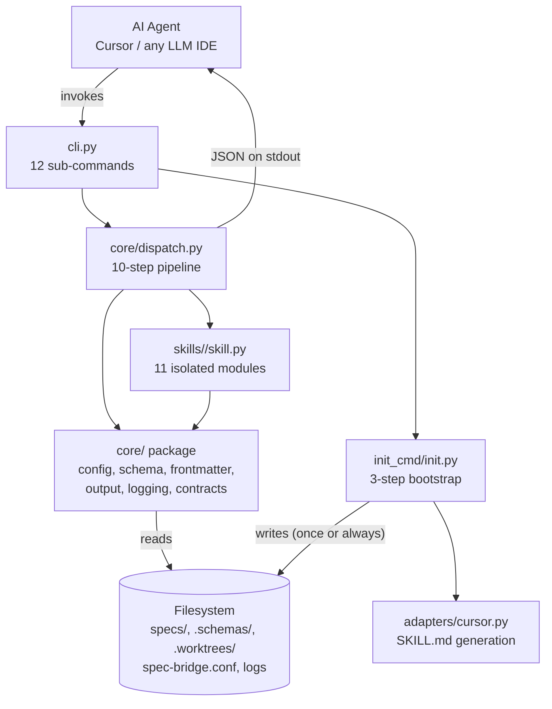

# C4 Architecture Documentation

C4 model documentation for `spec-bridge-v2` / `spec-bridge-skill-tool`.

## Contents

| Document | Description |
|----------|-------------|
| [1. Project Overview](./1-project-overview.md) | What the project is, technology stack, key features, directory structure, and getting started guide |
| [2. Architecture Overview](./2-architecture-overview.md) | C4 Level 1 (system context), Level 2 (containers), Level 3 (components) with Mermaid diagrams; architectural patterns and key design decisions |
| [3. Workflow Overview](./3-workflow-overview.md) | SDD/SyDD lifecycle, init workflow, 10-step dispatch pipeline, schema loading, data flow, state management, and error handling |
| [4. Deep Dive: Core Module](./4-deep-dive/core-module.md) | `core/` package internals: dispatch pipeline, schema loader, contracts, output, and session logging |
| [4. Deep Dive: Skill Modules](./4-deep-dive/skill-modules.md) | All 11 skill implementations, WP lane state machine, isolation rules, SyDD validation rules, and how to add a new skill |
| [4. Deep Dive: Adapter and Init](./4-deep-dive/adapter-and-init.md) | `CursorAdapter`, template rendering, `run_init()` 3-step bootstrap, schema YAML format, and how to add a new agent |

## Architecture in One Diagram



## Two-Responsibility Contract

The tool does exactly two things:

```
1. Schema Validation (pre-condition)
   Load YAML schema files → derive Pydantic models → validate artifact frontmatter
   Any violation → structured error + exit 1 (before skill checks run)

2. Outcome Verification (post-condition)
   skill.run_checks() → CheckResult list → all passed? → exit 0 : exit 1
   Checks: artifact existence, frontmatter completeness, lane transitions
```

Nothing else. No file generation during validation. No orchestration. No auto-fixing.

## ADR Index

| ADR | Decision |
|-----|---------|
| [ADR-0001](../adr/0001-spec-bridge-skill-tool-as-separate-binary.md) | Separate binary, not an extension of spec-bridge v1 |
| [ADR-0002](../adr/0002-two-responsibility-model.md) | Exactly two responsibilities, constitutionally enforced |
| [ADR-0003](../adr/0003-skill-module-isolation.md) | Skill module isolation (no cross-skill imports) |
| [ADR-0004](../adr/0004-schema-first-artifact-design.md) | Schema YAML files as source of truth, runtime Pydantic derivation |
| [ADR-0005](../adr/0005-spec-bridge-conf-single-configuration-source.md) | Single config file, absent-safe |
| [ADR-0006](../adr/0006-structured-stdout-only-output.md) | JSON on stdout only, never stderr |
| [ADR-0007](../adr/0007-adapter-pattern-for-agent-specific-file-generation.md) | Adapter pattern for agent-specific file generation |
